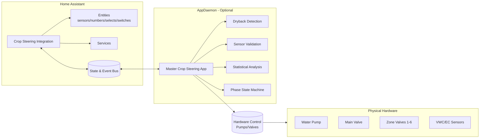

# Crop Steering System for Home Assistant (v2.3.1)


-blue)


Turn Home Assistant into a professional crop‑steering controller. This project combines a lightweight HA integration (entities, services) with optional AppDaemon modules (advanced analytics, phase state machine) to automate precision irrigation using VWC/EC sensors.

## How This System Works - Complete Overview

### 1. Big-Picture Overview

**What is crop steering in this system?**
- A precision irrigation method using Athena-style phases (P0→P1→P2→P3) that cycle daily with your grow lights
- Automatically adjusts water delivery based on moisture (VWC) and nutrient concentration (EC) sensors
- Supports both vegetative (high moisture, lower EC) and generative (controlled drought stress, higher EC) steering modes

**What the system automates:**
- Decides when to irrigate based on sensor data and phase logic
- Calculates shot sizes (how much water) based on pot volume and phase requirements  
- Adjusts thresholds dynamically using EC ratio (prevents salt buildup)
- Sequences hardware safely (pump → main line → zone valve → irrigate → shutdown)
- Transitions between phases automatically around lights on/off times

**What inputs it needs:**
- VWC sensors (moisture %) - ideally front and back per zone
- EC sensors (nutrient concentration mS/cm) - ideally front and back per zone
- Hardware switches for pump, main line valve, and zone valves (1-6 zones)
- Optional: temperature, humidity, VPD, tank level sensors

**What outputs it controls:**
- Pump switch (turns water pump on/off)
- Main line valve switch (opens/closes main distribution)
- Zone valve switches (opens specific zone for irrigation)
- 100+ Home Assistant entities for monitoring and control

### 2. System Architecture

**Home Assistant Custom Integration (domain: crop_steering):**
- Creates and manages entities (sensors, numbers, selects, switches)
- Registers services you can call:
  - `crop_steering.transition_phase` - manually change between P0/P1/P2/P3
  - `crop_steering.execute_irrigation_shot` - trigger an irrigation event with zone + duration
  - `crop_steering.check_transition_conditions` - evaluate if phase change should occur
  - `crop_steering.set_manual_override` - take manual control of a zone temporarily or permanently
- Performs calculations (shot durations, EC ratio, adjusted thresholds)
- Fires events that AppDaemon listens to

**AppDaemon Master App (optional but recommended for automation):**
- Listens to sensor updates and integration events
- Makes irrigation decisions based on phase logic and thresholds
- Sequences hardware safely to prevent damage
- Manages phase transitions automatically
- Validates sensor data and detects anomalies

**Configuration sources:**
- Primary: Integration UI during setup (maps hardware and sensors)
- Optional: config.yaml for advanced mapping
- AppDaemon apps.yaml to enable automation modules

**Data flow in simple terms:**
```
Sensors → HA entities → AppDaemon logic → HA services/events → Hardware switches
```

### 3. Entities You'll See in Home Assistant

**Input entities (you provide/map these):**
- Zone switches: `switch.irrigation_zone_1` through `switch.irrigation_zone_6`
- Pump switch: `switch.water_pump` (or your pump entity)
- Main line valve: `switch.main_line_valve` (if used)
- VWC sensors per zone: `sensor.zone_1_vwc_front`, `sensor.zone_1_vwc_back`
- EC sensors per zone: `sensor.zone_1_ec_front`, `sensor.zone_1_ec_back`
- Optional environment: temperature, humidity, VPD, tank level sensors

**Output entities (created by the integration):**
- Phase select: `select.crop_steering_irrigation_phase` (P0/P1/P2/P3/Manual)
- Average sensors: `sensor.crop_steering_configured_avg_vwc`, `sensor.crop_steering_configured_avg_ec`
- EC ratio: `sensor.crop_steering_ec_ratio` (current EC ÷ target EC)
- Adjusted threshold: `sensor.crop_steering_p2_vwc_threshold_adjusted`
- Shot durations: `sensor.crop_steering_p1_shot_duration_seconds`, etc.
- Number entities for all parameters: VWC targets, EC targets, shot sizes, timing
- Manual override switches: `switch.crop_steering_zone_1_manual_override`
- Zone status sensors: `sensor.crop_steering_zone_1_status` (Optimal/Dry/Saturated/etc.)

**Naming convention:** All created entities start with `crop_steering_` for easy identification

### 4. How a Typical Day Flows

**P0 - Morning Dryback (starts at lights-on):**
- System waits for substrate to dry to target level (e.g., 15-20% drop from peak)
- Enforces minimum wait time (e.g., 30 minutes) and maximum wait time (e.g., 3 hours)
- Once dryback target or max time reached → transitions to P1

**P1 - Ramp-Up (builds moisture back up):**
- Starts with small shots (e.g., 2% of pot volume)
- Each shot increases progressively (e.g., +0.5% each time)
- Continues until target VWC reached (e.g., 65% for vegetative, 60% for generative)
- Once target reached → transitions to P2

**P2 - Maintenance (bulk of the day):**
- Monitors VWC against threshold (e.g., irrigate when drops below 60%)
- Threshold auto-adjusts based on EC ratio:
  - High EC ratio (>1.3) → threshold increases to flush salts
  - Low EC ratio (<0.7) → threshold decreases to concentrate nutrients
- Delivers consistent shot size (e.g., 5% of pot volume)
- Continues until approaching lights-off → transitions to P3

**P3 - Pre-Lights-Off (preparation for night):**
- Stops regular irrigation 30-90 minutes before lights-off
- Only allows emergency shots if VWC drops critically low (e.g., below 40%)
- Remains in P3 through the night
- At lights-on → transitions back to P0

**Vegetative vs Generative modes:**
- Vegetative: Higher VWC targets (65-70%), lower EC targets (1.5-2.0 mS/cm), more frequent irrigation
- Generative: Lower VWC targets (55-60%), higher EC targets (2.5-3.5 mS/cm), controlled stress

### 5. What Actually Triggers Things

**Sensor updates trigger evaluation:**
- Every VWC/EC sensor update causes AppDaemon to re-evaluate conditions
- Checks if thresholds crossed, phase transitions needed, or emergency conditions exist

**Key Home Assistant services and their events:**

`crop_steering.transition_phase`:
- Updates the phase select entity
- Fires `crop_steering_phase_transition` event with:
  - target_phase (P0/P1/P2/P3)
  - reason (why transition occurred)
  - timestamp

`crop_steering.execute_irrigation_shot`:
- Fires `crop_steering_irrigation_shot` event with:
  - zone (1-6)
  - duration_seconds
  - shot_type (P1/P2/P3_emergency/manual)
- AppDaemon listens and executes the hardware sequence

`crop_steering.check_transition_conditions`:
- Evaluates current state
- Fires `crop_steering_transition_check` event with:
  - current conditions (VWC, EC, phase)
  - transition_reasons array
  - conditions_met boolean

`crop_steering.set_manual_override`:
- Toggles zone manual control
- Fires `crop_steering_manual_override` event with:
  - zone
  - action (enable/disable)
  - timeout_minutes (optional)

**These events are the communication bridge between the HA integration and AppDaemon automation**

### 6. How an Irrigation Shot Actually Runs

**Safe sequencing for each shot:**

1. **Pre-checks:**
   - Ensure no other irrigation in progress (prevent overlaps)
   - Verify zone is enabled and not in manual override
   - Check safety limits (max EC, emergency conditions)

2. **Hardware sequence:**
   - Turn on pump (2-second prime if starting cold)
   - Open main line valve (1-second stabilization)
   - Open target zone valve for calculated duration
   - Zone stays open for full duration (e.g., 45-120 seconds)

3. **Shutdown sequence:**
   - Close zone valve
   - Check if other zones need irrigation
   - If no other zones active: close main line, turn off pump
   - Log the shot for tracking

**Shot sizing calculations:**
- Based on: substrate volume (L) × shot percentage ÷ dripper flow rate (L/hr)
- P1: Starts at `p1_initial_shot_size` (e.g., 2%), increases by `p1_shot_increment` each time
- P2: Fixed at `p2_shot_size` (e.g., 5% of pot volume)
- P3 Emergency: Uses `p3_emergency_shot_size` (e.g., 3%)
- Per-zone multiplier allows individual adjustment

### 7. Safety, Limits, and Overrides

**Safety checks before irrigation:**
- **EC too high:** If EC > max limit, system may flush with larger shots or block irrigation
- **VWC limits:** Won't irrigate if already saturated (>75%) unless emergency
- **Lock mechanism:** Prevents multiple simultaneous irrigation attempts
- **Abandonment logic:** If zone doesn't respond after multiple attempts, marks as potentially blocked
- **Time-based lockouts:** Prevents irrigation loops (minimum time between shots)

**Manual override options:**
- **Temporary override:** Force zone on for X minutes (auto-disables after timeout)
- **Permanent override:** Take full manual control until explicitly disabled
- **Emergency stop:** System-wide disable switch stops all automation
- **Per-zone disable:** Individual zones can be excluded from automation

**Override behavior:**
- Manual overrides bypass normal phase logic
- Safety checks still apply where possible
- All manual actions logged for troubleshooting

### 8. Configuration the User Actually Does

**Through the Home Assistant UI:**
1. Settings → Devices & Services → Add Integration → Crop Steering System
2. Select number of zones (1-6)
3. Map your entities:
   - Pump switch entity ID
   - Main line valve entity ID (optional)
   - For each zone:
     - Zone valve switch entity ID
     - VWC sensor entities (front/back)
     - EC sensor entities (front/back)

**Key parameters to configure:**
- **Substrate:** pot volume (L), dripper flow rate (L/hr), drippers per plant
- **Targets:** VWC targets for P1/P2, dryback percentages, EC targets by phase
- **Timing:** lights on/off hours, minimum/maximum wait times
- **Shot sizes:** P1 initial/increment, P2 size, P3 emergency size

**AppDaemon setup (for automation):**
- Install AppDaemon add-on
- Copy app files to AppDaemon apps directory
- Ensure apps.yaml has master_crop_steering enabled
- Restart AppDaemon

**Validation:**
- Integration validates all entity IDs exist
- Shows "unknown" or "unavailable" warnings if entities missing
- Test with manual shots before enabling full automation

### 9. Operating the System Day-to-Day

**Dashboard controls you'll use:**
- **Phase display:** Shows current phase (P0/P1/P2/P3)
- **Manual phase change:** Override automatic transitions when needed
- **Zone status cards:** Display VWC%, EC, last irrigation time per zone
- **Average readings:** System-wide VWC/EC averages and EC ratio
- **Manual shot button:** Trigger test irrigation for specific zone/duration
- **Override switches:** Enable manual control during maintenance

**Monitoring:**
- **Next irrigation time:** Shows when system expects to irrigate
- **Daily water usage:** Track consumption per zone and total
- **EC ratio gauge:** Visual indicator if nutrients concentrated/diluted
- **Adjusted threshold:** See how EC ratio affects P2 trigger point

**Reading logs:**
- **HA logs:** Settings → System → Logs (shows service calls, errors)
- **AppDaemon logs:** Show irrigation decisions, phase transitions, safety blocks
- **Event monitoring:** Developer Tools → Events → Listen to `crop_steering_*` events

### 10. Troubleshooting Common Issues

**"Service not found" or "Integration not loaded":**
- Confirm integration installed and enabled
- Check Settings → System → Logs for integration errors
- Restart Home Assistant after installation

**"Entities missing" or showing "unknown":**
- Verify entity IDs in configuration exactly match your HA entities
- Check that sensor entities are providing numeric values
- Ensure hardware switches are accessible to HA

**"No irrigation happening":**
- Check current phase (may be in P0 waiting for dryback)
- Verify `switch.crop_steering_auto_irrigation_enabled` is on
- Review thresholds - VWC may be above threshold
- Check for safety lockouts in logs
- Ensure AppDaemon is running (for automation)

**"Overwatering" issues:**
- Reduce `p2_shot_size` percentage
- Increase `p2_vwc_threshold` to trigger less often
- Verify substrate volume and flow rate settings
- Check sensor calibration (may be reading low)

**"Underwatering" issues:**
- Increase `p2_shot_size` percentage
- Decrease `p2_vwc_threshold` for more frequent irrigation
- Verify dripper count and flow rate accurate
- Check for clogged drippers if specific zones affected

**"EC behaviors unexpected":**
- Verify EC sensors mapped correctly (not swapped)
- Check EC target settings for current growth stage
- Review if `switch.crop_steering_ec_stacking_enabled` is appropriate
- Ensure EC ratio adjustments enabled if desired

### 11. Example Scenarios

**Example A - Morning P0 → P1 transition:**
1. Lights turn on at 6 AM → System enters P0
2. VWC at lights-on: 68%
3. Target dryback: 15% drop (target 58%)
4. By 7:30 AM, VWC reaches 58%
5. System transitions to P1
6. First shot: 2% of pot volume (30 seconds)
7. Wait 5 minutes, VWC now 60%
8. Second shot: 2.5% (38 seconds)
9. Continue until VWC reaches 65% target
10. Transition to P2 for maintenance

**Example B - P2 maintenance shot on threshold:**
1. P2 threshold set at 60% VWC
2. EC ratio = 1.4 (high), so threshold adjusted to 65%
3. VWC drifts from 68% down to 64.5%
4. Crosses adjusted threshold → triggers shot
5. 5% shot delivered (75 seconds for 10L pot)
6. VWC returns to 69%
7. No more shots until next threshold crossing

**Example C - Manual override with timeout:**
1. User needs to flush Zone 2 for salt buildup
2. Calls service: `crop_steering.set_manual_override` with zone: 2, timeout: 30
3. Zone 2 override activates, shown in UI
4. User manually triggers several flush shots
5. After 30 minutes, override auto-disables
6. Zone 2 returns to automatic control

### 12. Glossary

- **VWC:** Volumetric Water Content - percentage of moisture in growing medium
- **EC:** Electrical Conductivity - measure of dissolved nutrients (mS/cm)
- **Phases:** P0 (dryback), P1 (ramp-up), P2 (maintenance), P3 (pre-lights-off)
- **Shot:** Single irrigation event with specific duration
- **Threshold:** VWC level that triggers P2 irrigation
- **EC ratio:** Current EC ÷ target EC (guides threshold adjustments)
- **Dryback:** Morning moisture loss that stimulates root growth
- **Field capacity:** Maximum water the medium can hold
- **Generative:** Growth mode focused on flowering/fruiting
- **Vegetative:** Growth mode focused on leaves/stems

### 13. How to Demo/Test Safely

**Initial setup for testing:**
1. Start with just 1-2 zones configured
2. Use short durations (30-45 seconds) initially
3. Set up test helper entities if no real sensors available

**Testing sequence:**
1. **Phase transitions:**
   - Use phase select dropdown to manually change phases
   - Watch events in Developer Tools → Events
   - Verify phase change appears in logs

2. **Manual shots:**
   - Call `crop_steering.execute_irrigation_shot`
   - Use zone: 1, duration_seconds: 30
   - Watch for pump → main → zone sequence
   - Verify proper shutdown after duration

3. **Transition conditions:**
   - Call `crop_steering.check_transition_conditions`
   - Review the event payload for reasoning
   - Adjust sensor values to trigger transitions

4. **Threshold testing:**
   - Set P2 threshold to current VWC + 2%
   - Manually lower VWC sensor value
   - Verify shot triggers when threshold crossed

5. **Safety testing:**
   - Set very high VWC (>75%) and verify no irrigation
   - Test emergency stop switch
   - Verify manual override works

**Before going live:**
- Verify all flow rates and pot volumes accurate
- Test full day cycle with reduced durations
- Monitor first full day closely
- Have manual override ready
- Keep logs accessible for troubleshooting

---

## Technical Details

### Component Architecture

- Home Assistant custom integration (custom_components/crop_steering)
  - Creates entities (sensors, numbers, selects, switches)
  - Performs core calculations in sensors
  - Exposes services and fires events for orchestration/hardware
- AppDaemon (optional, appdaemon/apps/crop_steering)
  - Rule-based automation: dryback detection, phase transitions, sensor processing
  - Listens to integration events and HA entity changes

This separation keeps the HA integration simple and robust while enabling powerful automation when AppDaemon is installed.

## Entities provided by the integration

Entity IDs follow the pattern crop_steering_<key> with per‑zone suffixes where applicable. The number of zones is chosen during config (1–6).

- Switches
  - Global: system_enabled (default on), auto_irrigation_enabled (default on), ec_stacking_enabled, analytics_enabled
  - Per‑zone: zone_X_enabled (default on), zone_X_manual_override

- Selects
  - crop_type (Cannabis_Athena, Cannabis_Hybrid, Cannabis_Indica, Cannabis_Sativa, Tomato, Lettuce, Basil, Custom)
  - growth_stage (Vegetative, Generative, Transition)
  - steering_mode (Vegetative, Generative)
  - irrigation_phase (P0, P1, P2, P3, Manual)
  - Per‑zone: zone_X_group (Ungrouped, Group A–D), zone_X_priority (Critical/High/Normal/Low), zone_X_crop_profile (Follow Main, …)

- Numbers (globals)
  - Substrate/hydraulics: substrate_volume (L), dripper_flow_rate (L/hr), drippers_per_plant
  - Moisture targets: field_capacity (%), veg_dryback_target (%), gen_dryback_target (%), p1_target_vwc (%), p2_vwc_threshold (%)
  - P0: p0_min_wait_time (min), p0_max_wait_time (min), p0_dryback_drop_percent (%)
  - P1: p1_initial_shot_size (%), p1_shot_increment (%), p1_max_shot_size (%), p1_time_between_shots (min), p1_max_shots, p1_min_shots
  - P2: p2_shot_size (%), p2_ec_high_threshold, p2_ec_low_threshold
  - P3: p3_veg_last_irrigation (min), p3_gen_last_irrigation (min), p3_emergency_vwc_threshold (%), p3_emergency_shot_size (%)
  - EC targets (mS/cm): ec_target_flush, ec_target_veg_p0..p3, ec_target_gen_p0..p3
  - Light schedule (system‑wide): lights_on_hour, lights_off_hour (0–23)

- Numbers (per‑zone)
  - zone_X_plant_count, zone_X_max_daily_volume (L), zone_X_shot_size_multiplier (%)

- Sensors (globals)
  - current_phase (reads AppDaemon phase if available, else integration select)
  - irrigation_efficiency (%), water_usage_daily (L), dryback_percentage (%)
  - next_irrigation_time (timestamp, from AppDaemon if present)
  - p1_shot_duration_seconds, p2_shot_duration_seconds, p3_shot_duration_seconds
  - ec_ratio (avg EC ÷ current phase target EC)
  - p2_vwc_threshold_adjusted (%; auto‑adjusts by EC ratio and high/low thresholds)
  - configured_avg_vwc (%), configured_avg_ec (mS/cm) across all configured zone sensors

- Sensors (per‑zone)
  - vwc_zone_X (%), ec_zone_X (mS/cm)
  - zone_X_status (Optimal/Dry/Saturated/Disabled/Sensor Error)
  - zone_X_last_irrigation (timestamp, from AppDaemon if present)
  - zone_X_daily_water_usage (L), zone_X_weekly_water_usage (L), zone_X_irrigation_count_today

Note: Some globals are placeholders until AppDaemon or automations provide backing data.

## Built‑in calculations (in sensors)

- Shot duration (seconds)
  - P1: duration = (substrate_volume × p1_initial_shot_size%) ÷ dripper_flow_rate × 3600
  - P2: duration = (substrate_volume × p2_shot_size%) ÷ dripper_flow_rate × 3600
  - P3: duration = (substrate_volume × p3_emergency_shot_size%) ÷ dripper_flow_rate × 3600
- EC ratio = configured_avg_ec ÷ current phase target EC (selected via steering_mode + irrigation_phase)
- Adjusted P2 threshold
  - base p2_vwc_threshold shifted ±5% when ec_ratio is above p2_ec_high_threshold or below p2_ec_low_threshold
- Zone averages and statuses
  - VWC/EC per zone averaged from front/back sensors (if both configured)
  - Status derived from VWC ranges with basic sanity checks

## Services (domain: crop_steering)

- transition_phase
  - target_phase: P0|P1|P2|P3 (required)
  - reason: string (optional)
  - forced: boolean (optional)
  - Action: sets select.crop_steering_irrigation_phase, fires crop_steering_phase_transition event

- execute_irrigation_shot
  - zone: validated against configured zones (required)
  - duration_seconds: 1–3600 (required)
  - shot_type: P1|P2|P3_emergency (optional; default manual)
  - Action: fires crop_steering_irrigation_shot event for hardware orchestration

- check_transition_conditions
  - No inputs
  - Action: evaluates current phase, avg VWC/EC, EC ratio, and emits crop_steering_transition_check with reasons

- set_manual_override
  - zone: 1–6 (required)
  - timeout_minutes: 1–1440 (optional)
  - enable: boolean (optional; default true)
  - Action: toggles switch.crop_steering_zone_X_manual_override and fires crop_steering_manual_override

### Services summary (quick reference)

| Service | Inputs (required in bold) | Effect |
|---|---|---|
| crop_steering.transition_phase | **target_phase** (P0/P1/P2/P3), reason, forced | Sets phase select, fires phase_transition event |
| crop_steering.execute_irrigation_shot | **zone**, **duration_seconds**, shot_type | Fires irrigation_shot event (for hardware) |
| crop_steering.check_transition_conditions | – | Fires transition_check event with reasons |
| crop_steering.set_manual_override | **zone**, timeout_minutes, enable | Toggles per‑zone manual override, fires event |

## Events fired by the integration

- crop_steering_phase_transition { target_phase, reason, forced, timestamp }
- crop_steering_irrigation_shot { zone, duration_seconds, shot_type, timestamp }
- crop_steering_transition_check { current_phase, avg_vwc, avg_ec, ec_ratio, transition_reasons[], conditions_met, timestamp }
- crop_steering_manual_override { zone, action, timeout_minutes?, timestamp }

### Events summary (quick reference)

| Event | Payload highlights |
|---|---|
| crop_steering_phase_transition | target_phase, reason, forced, timestamp |
| crop_steering_irrigation_shot | zone, duration_seconds, shot_type, timestamp |
| crop_steering_transition_check | current_phase, avg_vwc, avg_ec, ec_ratio, transition_reasons[], conditions_met |
| crop_steering_manual_override | zone, action, timeout_minutes?, timestamp |

## Optional AppDaemon suite (advanced automation)

Located in appdaemon/apps/crop_steering:
- advanced_dryback_detection.py — Multi‑scale peak/valley detection, dryback % and prediction
- intelligent_sensor_fusion.py — IQR/outlier filtering, smoothing, confidence scoring
- ml_irrigation_predictor.py — Simplified predictor with rolling training window
- intelligent_crop_profiles.py — Profiles by crop/stage with adaptive parameters
- phase_state_machine.py — Zone state machine (P0/P1/P2/P3) with transition rules
- master_crop_steering_app.py — Orchestrates modules, listens to HA entities/events

Install AppDaemon if you want autonomous phase control, analytics, and hardware sequencing. The integration works without AppDaemon but will not perform advanced automation on its own.

## Installation

- Integration (HACS recommended)
  1) HACS → Integrations → Custom Repositories → https://github.com/JakeTheRabbit/HA-Irrigation-Strategy (Integration)
  2) Install "Crop Steering System", restart HA
  3) Settings → Devices & Services → Add Integration → Crop Steering System

- AppDaemon (optional, for advanced features)
  1) Install AppDaemon 4 add‑on
  2) Use v15+ paths (supervised HA): /addon_configs/a0d7b954_appdaemon/
  3) Copy appdaemon/apps/crop_steering to your AppDaemon apps dir, include apps.yaml
  4) Restart AppDaemon

See docs/installation_guide.md for step‑by‑step details.

## Testing & Hardware Simulation

The integration automatically creates test helper entities for system simulation without requiring real hardware:

**Hardware Simulation (Input Boolean entities)**
- Pumps & Valves: water_pump_1/2, nutrient_pump_a/b/c, ph_up/down_pump, main_water_valve, zone_1-6_valve, recirculation_valve, drain_valve
- Status Indicators: system_ready, emergency_stop, various alarms and calibration status
- Operational States: auto_mode, manual_override, night_mode, maintenance_mode, flush_mode, dose_mode
- Zone Controls: zone_1-6_enabled 
- Safety Systems: flow/pressure sensor status, leak detection, pump overload protection
- Communication: modbus_connected, wifi_connected, sensor_hub_online, controller_responsive

**Sensor Simulation (Input Number entities)**
- Tank Sensors: water_level (%), pH (0-14), EC (mS/cm), temperature (°C), flow_rate (L/min), pressure (bar)
- Zone Sensors: Per-zone VWC (%), EC (mS/cm), temperature (°C) for zones 1-6
- Environmental: ambient_temperature/humidity, light_intensity (lux)
- System Performance: pump_frequency (Hz), valve_position (%), system_pressure (bar)

All test helpers are automatically created during integration setup and appear under the "Crop Steering Test Helpers" device. These entities maintain their state across Home Assistant restarts and provide realistic ranges with appropriate units and icons.

**Using Test Helpers**
1. Install the integration normally
2. Test helpers appear automatically in your entity list
3. Adjust input_number values to simulate sensor readings
4. Toggle input_boolean entities to simulate hardware states
5. Services and automations respond to these simulated inputs just like real hardware
6. No manual entity cleanup required - helpers are part of the integration

## Configuration

- GUI setup (recommended)
  - Choose number of zones (1–6)
  - Map hardware (pump/main line/zone switches) and sensors for each zone
  - Optionally map environmental sensors (temp/humidity/VPD)

- Import from YAML (optional)
  - The config flow supports importing from Home Assistant config.yaml (top‑level) with a zones: section
  - Integration validates referenced entity IDs during import

## Operation overview

- Phases (managed by AppDaemon state machine when installed)
  - P0 Morning dryback → P1 Ramp‑up → P2 Maintenance → P3 Pre‑lights‑off → back to P0 on lights‑on
  - Light timing uses lights_on_hour and lights_off_hour numbers (system‑wide)
- Per‑zone logic
  - Integration exposes per‑zone sensors, numbers, switches; AppDaemon decides when to irrigate per zone
- Safety & limits
  - Emergency thresholds and manual overrides available per zone

## Tips

- Provide two VWC/EC sensors per zone for better averaging
- Start with defaults, then tune p2_vwc_threshold and EC targets to match your media/genetics
- Use zone_X_shot_size_multiplier to bias individual zones without changing global targets

## Troubleshooting

- Use the check_transition_conditions service to see current reasoning
- Ensure AppDaemon is installed and apps copied if advanced features are expected
- Validate all entity IDs during setup; missing sensors will result in None/0 readings
- CI validates manifest and structure; no extra python deps are required

## License

MIT License

## Acknowledgments

- Home Assistant Community, AppDaemon developers, and contributors advancing precision irrigation

## Architecture diagram



## Modules & key classes

- custom_components/crop_steering
  - services.py — registers services and fires events
  - sensor.py — Sensor entities and calculations (avg EC/VWC, EC ratio, shot durations, adjusted thresholds)
  - number.py — All tunable parameters (substrate, P0/P1/P2/P3, EC targets, lights hours, per‑zone limits)
  - select.py — crop_type, growth_stage, steering_mode, irrigation_phase; per‑zone group/priority/profile
  - switch.py — global toggles and per‑zone enable/manual override
  - __init__.py — setup/unload, platform load, service setup

- appdaemon/apps/crop_steering (optional)
  - master_crop_steering_app.py — MasterCropSteeringApp (orchestrates modules, listens to HA)
  - advanced_dryback_detection.py — Peak/valley detection for moisture patterns
  - intelligent_sensor_fusion.py — Multi-sensor averaging and validation
  - ml_irrigation_predictor.py — Statistical trend analysis for irrigation timing
  - phase_state_machine.py — 4-phase irrigation cycle automation (P0-P3)
  - intelligent_crop_profiles.py — Plant-specific parameter management

## Screenshots


