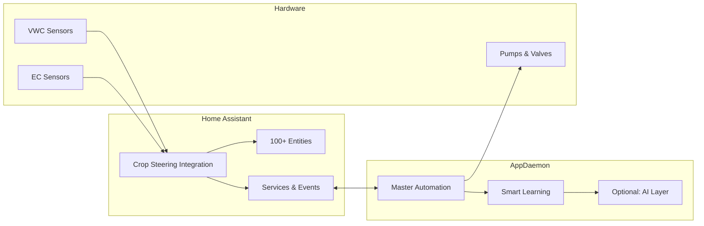

# Intelligent Crop Steering System for Home Assistant


**Transform your Home Assistant into a professional crop steering controller** with precision irrigation automation, intelligent learning optimization, and optional AI decision assistance.

> **New Users**: Start with our [Getting Started Guide](docs/user-guides/01-getting-started.md) | **Experienced**: Jump to [Complete Installation](docs/user-guides/02-installation.md)

## 🌟 What This System Does

**Core Automation**
- 4-phase daily irrigation cycles (P0→P1→P2→P3) synchronized with grow lights
- Precision VWC (moisture) and EC (nutrient) monitoring with multi-sensor validation
- Safety-first hardware control with comprehensive error handling and emergency stops
- Real-time dashboard with 100+ entities for complete system visibility

**Intelligent Learning** ⭐ *Unique Feature*
- Zero-hardware learning system using pressure-compensating dripper precision
- Automatic field capacity detection and zone characterization 
- Adaptive shot sizing based on each zone's learned absorption patterns
- Channeling detection and substrate optimization over time

**Optional AI Enhancement**
- GPT-5 consultation for complex irrigation decisions ($0.05-1.25/day)
- Stateless analysis with rule-based safety validation
- Natural language explanations of irrigation recommendations

## 🎯 Choose Your Path

### 🌱 **Beginner Path** (30-60 minutes)
Perfect for first-time users wanting reliable automation:

**What You Get:** Basic crop steering with manual control
- ✅ Home Assistant integration with dashboard
- ✅ Manual irrigation services and monitoring
- ✅ VWC/EC calculations and phase tracking
- ✅ Hardware simulation for testing

**Next Steps:**
1. [Getting Started Guide](docs/user-guides/01-getting-started.md) - Learn the fundamentals
2. [Quick Installation](docs/user-guides/02-installation.md#quick-start) - 15-minute setup
3. [Basic Configuration](docs/user-guides/03-configuration.md) - Set up monitoring

### 🔧 **Intermediate Path** (2-4 hours)
For users wanting full automation with AppDaemon:

**What You Get:** Complete hands-off irrigation system
- ✅ Everything from Beginner Path
- ✅ Autonomous 4-phase cycle automation
- ✅ Sensor validation and statistical analysis
- ✅ Hardware sequencing and safety protocols
- ✅ Advanced scheduling and optimization

**Next Steps:**
1. [Complete Installation](docs/user-guides/02-installation.md#complete-setup) - Full automation
2. [Daily Operation Guide](docs/user-guides/04-daily-operation.md) - System management
3. [Automation Examples](docs/examples/automation-examples.md) - Advanced patterns

### 🚀 **Advanced Path** (4-8 hours)
For power users wanting cutting-edge intelligence:

**What You Get:** AI-enhanced adaptive irrigation
- ✅ Everything from Intermediate Path  
- ✅ Intelligent learning optimization (no additional hardware!)
- ✅ Automatic field capacity detection per zone
- ✅ Adaptive parameter tuning based on plant responses
- ✅ Optional: GPT-4o AI consultation and analysis

**Next Steps:**
1. [Smart Learning System](docs/advanced-features/smart-learning-system.md) - Zero-hardware intelligence
2. [LLM Integration](docs/advanced-features/llm-integration.md) - AI decision assistance
3. [Technical Reference](docs/technical/) - Complete system documentation

## 🏗️ System Architecture



## 📊 Feature Comparison

| Feature | Basic Integration | + AppDaemon | + Smart Learning | + AI Enhancement |
|---------|------------------|-------------|------------------|------------------|
| **Manual Control** | ✅ Full | ✅ Full | ✅ Full | ✅ Full |
| **Automated Cycles** | ❌ | ✅ P0-P3 | ✅ P0-P3 | ✅ P0-P3 |
| **Safety Systems** | ✅ Basic | ✅ Advanced | ✅ Advanced | ✅ Advanced |
| **Zone Learning** | ❌ | ❌ | ✅ Adaptive | ✅ AI-Enhanced |
| **Field Capacity Detection** | ❌ | ❌ | ✅ Automatic | ✅ Intelligent |
| **Decision Assistance** | ❌ | ❌ | ❌ | ✅ GPT-4o |
| **Setup Time** | 30 min | 2-4 hours | +1 week learning | +Setup costs |
| **Hardware Required** | Basic sensors | Same | Same | Same |
| **Monthly Cost** | Free | Free | Free | $5-45 (optional) |

## 🚀 Quick Start Examples

### Pressure-Compensating Dripper Setup
```yaml
# Your existing hardware is perfect for intelligent learning!
dripper_specs:
  flow_rate: 1.2  # L/hr per dripper (pressure compensating)
  drippers_per_plant: 2
  plants_per_zone: 4
  
# System calculates exact water delivery:
# 30 seconds = (1.2 × 8 × 30) ÷ 3600 = 0.08L precisely
```

### Smart Learning Configuration
```yaml
# AppDaemon apps.yaml
smart_irrigation_learning:
  module: smart_irrigation_learning
  class: SmartIrrigationLearning
  zones: [1, 2, 3, 4, 5, 6]
  dripper_rate: 1.2           # Your PC dripper specs
  substrate_volume: 3.0       # Liters per plant
```

### AI Consultation Setup
```yaml
# Optional: AI decision assistance
llm_crop_steering:
  module: llm_enhanced_app
  class: LLMEnhancedCropSteering
  model: "gpt-5-nano"         # Cost-effective option ($0.05/$0.40 per 1M tokens)
  daily_budget: 1.00          # $1/day limit
  confidence_threshold: 0.8   # Safety validation
```

## 💡 Why This System is Unique

### **Zero Additional Hardware Intelligence**
Unlike expensive commercial systems, our smart learning uses **pressure-compensating dripper precision** to achieve field capacity detection and efficiency optimization without flow sensors, load cells, or complex equipment.

### **Safety-First Design**
- **Rule-based validation** of all AI decisions
- **Multiple fallback layers** prevent crop damage
- **Emergency stop systems** with manual override capability
- **Comprehensive logging** for complete traceability

### **Professional Features at Hobby Cost**
- **AROYA-style automation** without $3,000/month subscriptions
- **Athena method compatibility** with proper EC ratio management  
- **Complete system integration** with Home Assistant ecosystem
- **Open source flexibility** with commercial-grade reliability

## 📖 Documentation Guide

### User Guides (Start Here)
- **[01 - Getting Started](docs/user-guides/01-getting-started.md)** - System fundamentals and concepts
- **[02 - Installation](docs/user-guides/02-installation.md)** - Progressive setup guide (Basic → Complete → Advanced)
- **[03 - Configuration](docs/user-guides/03-configuration.md)** - Dashboard setup and system tuning
- **[04 - Daily Operation](docs/user-guides/04-daily-operation.md)** - Monitoring and maintenance procedures
- **[05 - Troubleshooting](docs/user-guides/05-troubleshooting.md)** - Common issues and solutions

### Advanced Features
- **[Smart Learning System](docs/advanced-features/smart-learning-system.md)** - Intelligent optimization without additional hardware
- **[LLM Integration](docs/advanced-features/llm-integration.md)** - AI decision assistance and cost management

### Technical Reference
- **[Entity Reference](docs/technical/entity-reference.md)** - Complete entity documentation
- **[Service Reference](docs/technical/service-reference.md)** - API and service documentation  
- **[System Architecture](docs/technical/architecture.md)** - Technical implementation details

### Examples & Patterns
- **[Automation Examples](docs/examples/automation-examples.md)** - Advanced automation patterns
- **[Dashboard Examples](docs/examples/dashboard-examples.md)** - Professional dashboard layouts

## 🛠️ Hardware Requirements

### Minimum (Basic Integration)
- **Home Assistant** server (Raspberry Pi 4+ or x86)
- **VWC sensors** (capacitive soil moisture sensors)
- **EC sensors** (electrical conductivity probes)
- **Irrigation hardware** (pumps, valves, drippers)

### Recommended (Complete System)
- **Pressure-compensating drippers** (1-2 L/hr rated)
- **Dual sensors per zone** (front/back placement for averaging)
- **Environmental sensors** (temperature, humidity, VPD - optional)
- **UPS power backup** for reliability during outages

### Advanced (AI Enhancement)
- **Enhanced server** (16GB RAM recommended for AI processing)
- **Stable internet** for LLM API access
- **Flow monitoring** (optional - PC drippers provide precision)

## 🏆 Success Stories

> *"Reduced water usage by 30% while improving plant health. The learning system adapted to each zone's unique characteristics within 2 weeks."* - Advanced User

> *"Perfect for beginners - the step-by-step guides had me running in 30 minutes. Added AppDaemon automation later when I was ready."* - New User

> *"The AI consultation catches edge cases my rules miss. Worth the $0.50/day for the natural language explanations alone."* - AI Integration User

## 🤝 Community & Support

### Getting Help
- **[Troubleshooting Guide](docs/user-guides/05-troubleshooting.md)** - Solve common issues
- **[GitHub Issues](https://github.com/JakeTheRabbit/HA-Irrigation-Strategy/issues)** - Report bugs or request features
- **[Home Assistant Community](https://community.home-assistant.io/)** - General HA support

### Contributing
- **[Contributing Guidelines](CONTRIBUTING.md)** - How to help improve the system
- **[Development Setup](docs/development/)** - Set up development environment
- **Code of Conduct** - Be respectful and inclusive

### Commercial Use
This system is MIT licensed and suitable for commercial growing operations. Many users scale from hobby grows to professional operations using the same foundation.

## 📈 What's Next

### Planned Features
- **Mobile app integration** for remote monitoring
- **Weather API integration** for environmental optimization
- **Multi-facility management** for commercial operators
- **Advanced ML models** for predictive scheduling

### Upgrade Path
The system is designed for easy expansion:
1. **Start simple** with basic integration
2. **Add automation** when comfortable with concepts  
3. **Enable learning** for optimization without new hardware
4. **Enhance with AI** for cutting-edge decision assistance

---

## ⚡ Ready to Get Started?

### Quick Decision Tree:
- **New to crop steering?** → [Getting Started Guide](docs/user-guides/01-getting-started.md)
- **Ready to install?** → [Installation Guide](docs/user-guides/02-installation.md)
- **Want advanced features?** → [Smart Learning System](docs/advanced-features/smart-learning-system.md)
- **Technical questions?** → [Technical Reference](docs/technical/)

**Start your intelligent crop steering journey today!** 🌱→🌿→🌳

---

<p align="center">
  <strong>Transform your growing operation with professional automation and intelligent optimization</strong><br>
  <em>Built for Home Assistant • Open Source • Production Ready</em>
</p>