# Crop Steering System for Home Assistant (v2.3.1)


-blue)


Turn Home Assistant into a precision crop‑steering controller using rule-based logic with **optional** LLM assistance. This project combines a lightweight HA integration (entities, services, calculations) with optional AppDaemon modules (automation, analytics, phase state machine) to automate precision irrigation using VWC/EC sensors.

## 🤖 **Optional: LLM Integration (Experimental)**
Add AI-powered decision assistance to traditional rule-based irrigation:
- **Stateless consultation**: LLM analyzes current sensor data and recommends actions
- **Cost-effective**: GPT-5-nano at $0.05 per million tokens (~$0.10-0.50/day)
- **Safety-first**: Rule-based fallbacks when LLM confidence is low (<80%)
- **No persistent memory**: Each decision is independent (no learning between calls)
- **Advisory role**: LLM suggests, traditional logic validates and executes

### 💰 **Cost Reality Check**

| Component | Monthly Cost | What You Actually Get |
|-----------|-------------|----------------------|
| **Base System (Rules Only)** | $0 | Proven 4-phase irrigation automation |
| **LLM Enhancement** | $3-15 | Intelligent analysis of current conditions only |
| **Total** | **$3-15** | **Rule-based + AI consultation** |

*LLM provides intelligent analysis but does not replace core automation logic*

## How This System Works - Complete Overview

### 1. Big-Picture Overview

**What is crop steering in this system?**
- A precision irrigation method using Athena-style phases (P0→P1→P2→P3) that cycle daily with your grow lights
- Automatically adjusts water delivery based on moisture (VWC) and nutrient concentration (EC) sensors
- Supports both vegetative (high moisture, lower EC) and generative (controlled drought stress, higher EC) steering modes

**What the system automates:**
- Decides when to irrigate based on sensor data and phase logic
- Calculates shot sizes (how much water) based on pot volume and phase requirements  
- Adjusts thresholds dynamically using EC ratio (prevents salt buildup)
- Sequences hardware safely (pump → main line → zone valve → irrigate → shutdown)
- Transitions between phases automatically around lights on/off times

**What inputs it needs:**
- VWC sensors (moisture %) - ideally front and back per zone
- EC sensors (nutrient concentration mS/cm) - ideally front and back per zone
- Hardware switches for pump, main line valve, and zone valves (1-6 zones)
- Optional: temperature, humidity, VPD, tank level sensors

**What outputs it controls:**
- Pump switch (turns water pump on/off)
- Main line valve switch (opens/closes main distribution)
- Zone valve switches (opens specific zone for irrigation)
- 100+ Home Assistant entities for monitoring and control

### 2. System Architecture

**Home Assistant Custom Integration (domain: crop_steering):**
- Creates and manages entities (sensors, numbers, selects, switches)
- Registers services you can call:
  - `crop_steering.transition_phase` - manually change between P0/P1/P2/P3
  - `crop_steering.execute_irrigation_shot` - trigger an irrigation event with zone + duration
  - `crop_steering.check_transition_conditions` - evaluate if phase change should occur
  - `crop_steering.set_manual_override` - take manual control of a zone temporarily or permanently
- Performs calculations (shot durations, EC ratio, adjusted thresholds)
- Fires events that AppDaemon listens to

**AppDaemon Master App (optional automation layer):**
- **Core Automation**: Rule-based phase transitions, sensor validation, hardware sequencing
- **Optional LLM Consultation**: Analyzes current sensor snapshot for intelligent recommendations
- **Stateless AI**: Each LLM call is independent with no memory of previous decisions
- **Safety-first**: Traditional logic validates all decisions before hardware execution
- **Cost-controlled**: Budget limits and model selection (gpt-5-nano for routine analysis)
- Sequences hardware safely to prevent damage
- Validates sensor data and detects anomalies using statistical methods

**Configuration sources:**
- Primary: Integration UI during setup (maps hardware and sensors)
- Optional: config.yaml for advanced mapping
- AppDaemon apps.yaml to enable automation modules

**Data flow in simple terms:**
```
Sensors → HA entities → AppDaemon logic → HA services/events → Hardware switches
```

## How the LLM Integration Actually Works (Technical Reality)

### What the LLM Does vs Doesn't Do

**✅ LLM Capabilities:**
- Analyzes current sensor snapshot (VWC, EC, phase, temperature, etc.)
- Provides intelligent recommendations: "Irrigate now" or "Wait longer"
- Explains reasoning in natural language
- Considers multiple factors simultaneously (phase, EC ratio, environmental conditions)
- Suggests shot sizes and timing adjustments

**❌ LLM Limitations:**
- **No persistent memory**: Cannot remember previous decisions or plant responses
- **No learning**: Each API call is completely independent
- **No direct hardware control**: Only provides advisory recommendations
- **No autonomous operation**: Traditional logic must validate and execute all actions

### Code-Level Implementation

**1. Decision Request Flow:**
```python
# In AppDaemon master app (llm_enhanced_app.py)
async def evaluate_zone_irrigation(self, zone_id):
    # Gather current sensor data
    sensor_data = {
        'vwc': self.get_zone_vwc(zone_id),
        'ec': self.get_zone_ec(zone_id),
        'phase': self.get_current_phase(),
        'ec_ratio': self.calculate_ec_ratio(),
        'last_irrigation': self.get_last_irrigation_time(zone_id)
    }
    
    # Traditional rule-based decision (always calculated)
    rule_based_decision = self.traditional_irrigation_logic(sensor_data)
    
    # Optional: Consult LLM for additional insight
    if self.llm_enabled and self.within_budget():
        llm_recommendation = await self.llm_client.get_decision(
            sensor_data, 
            context="Zone irrigation evaluation"
        )
        
        # Validate LLM confidence threshold
        if llm_recommendation.confidence < 0.8:
            return rule_based_decision  # Fall back to rules
        
        # Traditional logic validates LLM suggestion
        if self.validate_llm_decision(llm_recommendation, sensor_data):
            return llm_recommendation
    
    return rule_based_decision  # Default to rule-based logic
```

**2. LLM Client Implementation:**
```python
# In custom_components/crop_steering/llm/client.py
class LLMClient:
    async def get_decision(self, sensor_data, context):
        # Build prompt with current sensor snapshot only
        prompt = f"""
        Current irrigation context: {context}
        
        Sensor Data:
        - Zone VWC: {sensor_data['vwc']}%
        - Zone EC: {sensor_data['ec']} mS/cm  
        - Current Phase: {sensor_data['phase']}
        - EC Ratio: {sensor_data['ec_ratio']}
        - Minutes since last irrigation: {sensor_data['last_irrigation']}
        
        Based on this snapshot, should I irrigate this zone now?
        Respond with: IRRIGATE or WAIT
        Confidence (0.0-1.0):
        Reasoning:
        """
        
        # Single API call to GPT-5 (stateless)
        response = await self.openai_client.chat.completions.create(
            model="gpt-5-nano",
            messages=[{"role": "user", "content": prompt}],
            max_tokens=150
        )
        
        # Parse response (no memory stored)
        return self.parse_llm_response(response)
```

**3. Integration with Traditional Logic:**
```python
# Traditional rule-based logic always available
def traditional_irrigation_logic(self, sensor_data):
    phase = sensor_data['phase']
    vwc = sensor_data['vwc']
    
    if phase == 'P1':
        return vwc < self.p1_target_vwc
    elif phase == 'P2':
        threshold = self.adjust_p2_threshold(sensor_data['ec_ratio'])
        return vwc < threshold
    elif phase == 'P3':
        return vwc < self.emergency_threshold
    
    return False  # P0 phase - no irrigation during dryback
```

**AppDaemon Master Logic Flow (Corrected):**
```mermaid
flowchart TD
    subgraph Initialization["🚀 AppDaemon Startup"]
        Start([Initialize]) --> Load[Load Config]
        Load --> Modules[Initialize Modules:<br/>• Rule-Based Logic<br/>• Sensor Validation<br/>• Phase State Machine<br/>• Optional: LLM Client]
        Modules --> Listen[Setup Event Listeners]
    end
    
    subgraph MainLoop["🔄 Main Processing Loop"]
        Listen --> SensorUpdate{Sensor Update?}
        SensorUpdate -->|Yes| Validate[Validate Sensor Data<br/>Statistical Outlier Detection]
        Validate --> Average[Calculate Averages<br/>Front/Back Sensors]
        Average --> StateCheck{Check Zone States}
        
        StateCheck --> Zone1{Zone 1}
        StateCheck --> Zone2{Zone 2}
        StateCheck --> ZoneN{Zone N...}
        
        Zone1 --> RuleLogic1[Traditional Rule Logic<br/>Always Calculated]
        Zone2 --> RuleLogic2[Traditional Rule Logic<br/>Always Calculated]
        ZoneN --> RuleLogicN[Traditional Rule Logic<br/>Always Calculated]
    end
    
    subgraph DecisionEngine["🧠 Hybrid Decision Engine"]
        RuleLogic1 --> LLMCheck{LLM Enabled?<br/>Within Budget?}
        RuleLogic2 --> LLMCheck
        RuleLogicN --> LLMCheck
        
        LLMCheck -->|No| UseRules[Use Rule-Based Decision]
        LLMCheck -->|Yes| ConsultLLM[Consult LLM<br/>Single API Call<br/>Current Snapshot Only]
        
        ConsultLLM --> ConfidenceCheck{LLM Confidence<br/>> 80%?}
        ConfidenceCheck -->|No| UseRules
        ConfidenceCheck -->|Yes| ValidateRec{Rule Logic<br/>Validates LLM?}
        
        ValidateRec -->|No| UseRules
        ValidateRec -->|Yes| UseLLM[Use LLM Recommendation]
        
        UseRules --> Safety{Safety Checks}
        UseLLM --> Safety
        
        Safety -->|Pass| Execute[Execute Irrigation]
        Safety -->|Fail| Log[Log Block Reason]
        
        Execute --> Hardware[Hardware Sequence:<br/>Pump → Main → Zone]
        Hardware --> Update[Update States]
    end
    
    subgraph Events["📨 Event Handlers"]
        Listen --> EventRcv{Event Received?}
        EventRcv -->|phase_transition| PhaseHandler[Update Phase<br/>Reset Counters]
        EventRcv -->|irrigation_shot| ShotHandler[Queue Shot<br/>Check Lock]
        EventRcv -->|manual_override| OverrideHandler[Set Override<br/>Start Timer]
        
        PhaseHandler --> StateCheck
        ShotHandler --> Safety
        OverrideHandler --> Log
    end
    
    Update --> SensorUpdate
    Log --> SensorUpdate
    
    style Initialization fill:#e8eaf6
    style MainLoop fill:#e0f2f1
    style DecisionEngine fill:#fff9c4
    style Events fill:#fce4ec

### LLM Communication Pattern (Stateless)

```mermaid
sequenceDiagram
    participant AD as AppDaemon App
    participant LC as LLM Client
    participant OAI as OpenAI API
    participant RL as Rule Logic
    participant HW as Hardware
    
    Note over AD: Sensor update triggers evaluation
    
    AD->>AD: Gather current sensor snapshot
    AD->>RL: Calculate rule-based decision
    
    alt LLM enabled and within budget
        AD->>LC: Request LLM consultation
        Note over LC: Build prompt with current data only
        LC->>OAI: Single API call (stateless)
        Note over OAI: GPT-5 analyzes snapshot<br/>NO memory of previous calls
        OAI->>LC: Response with confidence score
        LC->>AD: Parsed recommendation
        
        alt LLM confidence > 80%
            AD->>RL: Validate LLM recommendation
            alt Rule logic approves
                AD->>AD: Use LLM decision
            else Rule logic rejects
                AD->>AD: Use rule-based decision
            end
        else LLM confidence ≤ 80%
            AD->>AD: Use rule-based decision
        end
    else LLM disabled or over budget
        AD->>AD: Use rule-based decision
    end
    
    AD->>HW: Execute irrigation if approved
    
    Note over AD,OAI: Next sensor update = completely<br/>independent LLM consultation
```

### What Each LLM Call Actually Costs


### Memory and Learning Reality

**Current State: No Persistent Memory**
- Each LLM API call receives only current sensor snapshot
- No database of previous decisions or plant responses
- No learning from irrigation outcomes
- Each decision is completely independent

**Example of What Actually Happens:**
```python
# Call 1: Morning
llm_decision_1 = await llm.get_decision({
    'vwc': 55, 'ec': 2.1, 'phase': 'P1'
})  # Returns: "IRRIGATE - VWC below target"

# Call 2: 5 minutes later (INDEPENDENT)
llm_decision_2 = await llm.get_decision({
    'vwc': 62, 'ec': 2.0, 'phase': 'P1'  
})  # Returns: "WAIT - VWC acceptable"
# LLM has NO MEMORY of call 1!
```

**To Implement True Learning, You Would Need:**
1. **Decision Database**: Store all LLM recommendations with timestamps
2. **Outcome Tracking**: Monitor VWC/EC changes after each irrigation
3. **Success Scoring**: Calculate whether LLM decisions helped or hurt
4. **Context Injection**: Include historical performance in future prompts

### 3. Entities You'll See in Home Assistant

**Input entities (you provide/map these):**
- Zone switches: `switch.irrigation_zone_1` through `switch.irrigation_zone_6`
- Pump switch: `switch.water_pump` (or your pump entity)
- Main line valve: `switch.main_line_valve` (if used)
- VWC sensors per zone: `sensor.zone_1_vwc_front`, `sensor.zone_1_vwc_back`
- EC sensors per zone: `sensor.zone_1_ec_front`, `sensor.zone_1_ec_back`
- Optional environment: temperature, humidity, VPD, tank level sensors

**Output entities (created by the integration):**
- Phase select: `select.crop_steering_irrigation_phase` (P0/P1/P2/P3/Manual)
- Average sensors: `sensor.crop_steering_configured_avg_vwc`, `sensor.crop_steering_configured_avg_ec`
- EC ratio: `sensor.crop_steering_ec_ratio` (current EC ÷ target EC)
- Adjusted threshold: `sensor.crop_steering_p2_vwc_threshold_adjusted`
- Shot durations: `sensor.crop_steering_p1_shot_duration_seconds`, etc.
- Number entities for all parameters: VWC targets, EC targets, shot sizes, timing
- Manual override switches: `switch.crop_steering_zone_1_manual_override`
- Zone status sensors: `sensor.crop_steering_zone_1_status` (Optimal/Dry/Saturated/etc.)

**Naming convention:** All created entities start with `crop_steering_` for easy identification

**Entity Relationship Flow:**

```mermaid
graph TB
    subgraph Inputs["📥 Input Entities (User Provides)"]
        VWC[VWC Sensors<br/>zone_1_vwc_front/back]
        EC[EC Sensors<br/>zone_1_ec_front/back]
        HW[Hardware Switches<br/>pump, main_valve, zone_valves]
        ENV[Environment Sensors<br/>temp, humidity, VPD]
    end
    
    subgraph Integration["⚙️ Integration Processing"]
        CALC[Calculations<br/>Shot Duration<br/>EC Ratio<br/>Thresholds]
        AVG[Averaging<br/>Zone VWC/EC<br/>System Averages]
    end
    
    subgraph Outputs["📤 Created Entities"]
        PHASE[Phase Select<br/>P0/P1/P2/P3]
        SENSORS[Calculated Sensors<br/>ec_ratio, adjusted_threshold]
        NUMBERS[Config Numbers<br/>targets, shot_sizes, timing]
        SWITCHES[Control Switches<br/>enabled, override, ec_stacking]
    end
    
    subgraph Services["🔧 Services"]
        SVC1[transition_phase]
        SVC2[execute_irrigation_shot]
        SVC3[check_conditions]
        SVC4[set_manual_override]
    end
    
    VWC --> AVG
    EC --> AVG
    AVG --> CALC
    CALC --> SENSORS
    HW --> Services
    PHASE --> Services
    Services --> AppDaemon[AppDaemon Automation]
    
    style Inputs fill:#e3f2fd
    style Integration fill:#fff3e0
    style Outputs fill:#e8f5e9
    style Services fill:#fce4ec
```


### 4. How a Typical Day Flows

**P0 - Morning Dryback (starts at lights-on):**
- System waits for substrate to dry to target level (e.g., 15-20% drop from peak)
- Enforces minimum wait time (e.g., 30 minutes) and maximum wait time (e.g., 3 hours)
- Once dryback target or max time reached → transitions to P1

**P1 - Ramp-Up (builds moisture back up):**
- Starts with small shots (e.g., 2% of pot volume)
- Each shot increases progressively (e.g., +0.5% each time)
- Continues until target VWC reached (e.g., 65% for vegetative, 60% for generative)
- Once target reached → transitions to P2

**P2 - Maintenance (bulk of the day):**
- Monitors VWC against threshold (e.g., irrigate when drops below 60%)
- Threshold auto-adjusts based on EC ratio:
  - High EC ratio (>1.3) → threshold increases to flush salts
  - Low EC ratio (<0.7) → threshold decreases to concentrate nutrients
- Delivers consistent shot size (e.g., 5% of pot volume)
- Continues until approaching lights-off → transitions to P3

**P3 - Pre-Lights-Off (preparation for night):**
- Stops regular irrigation 30-90 minutes before lights-off
- Only allows emergency shots if VWC drops critically low (e.g., below 40%)
- Remains in P3 through the night
- At lights-on → transitions back to P0

**Vegetative vs Generative modes:**
- Vegetative: Higher VWC targets (65-70%), lower EC targets (1.5-2.0 mS/cm), more frequent irrigation
- Generative: Lower VWC targets (55-60%), higher EC targets (2.5-3.5 mS/cm), controlled stress

**Daily Phase Cycle Visualization:**

```mermaid
graph LR
    subgraph Night["🌙 Night Period"]
        P3N[P3: Pre-Lights-Off<br/>Emergency Only]
    end
    
    subgraph Morning["🌅 Morning"]
        LO[Lights On<br/>6:00 AM] --> P0[P0: Dryback<br/>Wait 30-180 min<br/>Target: -15% VWC]
    end
    
    subgraph Day["☀️ Day Period"]
        P0 --> P1[P1: Ramp-Up<br/>Progressive Shots<br/>2% → 10%]
        P1 --> P2[P2: Maintenance<br/>Threshold-Based<br/>5% shots @ <60% VWC]
        P2 --> P3[P3: Wind-Down<br/>90 min before lights-off]
    end
    
    subgraph Evening["🌆 Evening"]
        P3 --> LF[Lights Off<br/>10:00 PM]
    end
    
    LF --> P3N
    P3N --> LO

    style P0 fill:#ffeb3b
    style P1 fill:#4caf50
    style P2 fill:#2196f3
    style P3 fill:#ff9800
```


**Phase State Machine Logic:**


### 5. What Actually Triggers Things

**Sensor updates trigger evaluation:**
- Every VWC/EC sensor update causes AppDaemon to re-evaluate conditions
- Checks if thresholds crossed, phase transitions needed, or emergency conditions exist

**Key Home Assistant services and their events:**

`crop_steering.transition_phase`:
- Updates the phase select entity
- Fires `crop_steering_phase_transition` event with:
  - target_phase (P0/P1/P2/P3)
  - reason (why transition occurred)
  - timestamp

`crop_steering.execute_irrigation_shot`:
- Fires `crop_steering_irrigation_shot` event with:
  - zone (1-6)
  - duration_seconds
  - shot_type (P1/P2/P3_emergency/manual)
- AppDaemon listens and executes the hardware sequence

`crop_steering.check_transition_conditions`:
- Evaluates current state
- Fires `crop_steering_transition_check` event with:
  - current conditions (VWC, EC, phase)
  - transition_reasons array
  - conditions_met boolean

`crop_steering.set_manual_override`:
- Toggles zone manual control
- Fires `crop_steering_manual_override` event with:
  - zone
  - action (enable/disable)
  - timeout_minutes (optional)

**These events are the communication bridge between the HA integration and AppDaemon automation**

**Irrigation Decision Tree:**


**Event Flow and Communication:**

```mermaid
flowchart LR
    subgraph User["👤 User Actions"]
        UI[HA Dashboard<br/>Buttons/Selects]
        API[Service Calls<br/>Developer Tools]
    end
    
    subgraph HACore["🏠 Home Assistant Core"]
        SVC[Services<br/>crop_steering.*]
        EVENT[Event Bus]
        STATE[State Machine]
    end
    
    subgraph Events["📡 Events Fired"]
        E1[crop_steering_phase_transition]
        E2[crop_steering_irrigation_shot]
        E3[crop_steering_transition_check]
        E4[crop_steering_manual_override]
    end
    
    subgraph AppD["🤖 AppDaemon"]
        LISTEN[Event Listeners]
        LOGIC[Decision Logic]
        ACTION[Hardware Control]
    end
    
    UI --> SVC
    API --> SVC
    SVC --> EVENT
    EVENT --> E1
    EVENT --> E2
    EVENT --> E3
    EVENT --> E4
    
    E1 --> LISTEN
    E2 --> LISTEN
    E3 --> LISTEN
    E4 --> LISTEN
    
    LISTEN --> LOGIC
    LOGIC --> ACTION
    ACTION --> STATE
    STATE --> UI
    
    style Events fill:#ffecb3
    style HACore fill:#e1bee7
    style AppD fill:#c5e1a5
```


### 6. How an Irrigation Shot Actually Runs

**Safe sequencing for each shot:**

1. **Pre-checks:**
   - Ensure no other irrigation in progress (prevent overlaps)
   - Verify zone is enabled and not in manual override
   - Check safety limits (max EC, emergency conditions)

2. **Hardware sequence:**
   - Turn on pump (2-second prime if starting cold)
   - Open main line valve (1-second stabilization)
   - Open target zone valve for calculated duration
   - Zone stays open for full duration (e.g., 45-120 seconds)

3. **Shutdown sequence:**
   - Close zone valve
   - Check if other zones need irrigation
   - If no other zones active: close main line, turn off pump
   - Log the shot for tracking

**Shot sizing calculations:**
- Based on: substrate volume (L) × shot percentage ÷ dripper flow rate (L/hr)
- P1: Starts at `p1_initial_shot_size` (e.g., 2%), increases by `p1_shot_increment` each time
- P2: Fixed at `p2_shot_size` (e.g., 5% of pot volume)
- P3 Emergency: Uses `p3_emergency_shot_size` (e.g., 3%)
- Per-zone multiplier allows individual adjustment

**Hardware Sequencing Diagram:**


**Shot Calculation Flow:**


### 7. Safety, Limits, and Overrides

**Safety checks before irrigation:**
- **EC too high:** If EC > max limit, system may flush with larger shots or block irrigation
- **VWC limits:** Won't irrigate if already saturated (>75%) unless emergency
- **Lock mechanism:** Prevents multiple simultaneous irrigation attempts
- **Abandonment logic:** If zone doesn't respond after multiple attempts, marks as potentially blocked
- **Time-based lockouts:** Prevents irrigation loops (minimum time between shots)

**Manual override options:**
- **Temporary override:** Force zone on for X minutes (auto-disables after timeout)
- **Permanent override:** Take full manual control until explicitly disabled
- **Emergency stop:** System-wide disable switch stops all automation
- **Per-zone disable:** Individual zones can be excluded from automation

**Override behavior:**
- Manual overrides bypass normal phase logic
- Safety checks still apply where possible
- All manual actions logged for troubleshooting

**Safety Checks and Override Logic:**

```mermaid
flowchart TD
    Request([Irrigation Request]) --> SystemCheck{System<br/>Enabled?}
    SystemCheck -->|No| Block1[❌ Block:<br/>System Disabled]
    SystemCheck -->|Yes| AutoCheck{Auto Mode<br/>Enabled?}
    
    AutoCheck -->|No| ManualCheck{Manual<br/>Override?}
    ManualCheck -->|No| Block2[❌ Block:<br/>No Manual Override]
    ManualCheck -->|Yes| SafetyChecks
    AutoCheck -->|Yes| SafetyChecks
    
    subgraph SafetyChecks["🛡️ Safety Validation"]
        VWCCheck{VWC > 75%?}
        VWCCheck -->|Yes| Block3[❌ Block:<br/>Saturated]
        VWCCheck -->|No| ECCheck{EC > Max?}
        
        ECCheck -->|Yes| FlushCheck{Flush Mode?}
        FlushCheck -->|No| Block4[❌ Block:<br/>EC Too High]
        FlushCheck -->|Yes| LockCheck
        ECCheck -->|No| LockCheck
        
        LockCheck{Irrigation<br/>Lock Active?}
        LockCheck -->|Yes| Block5[❌ Block:<br/>Already Running]
        LockCheck -->|No| TimeCheck
        
        TimeCheck{Min Time<br/>Between Shots<br/>Elapsed?}
        TimeCheck -->|No| Block6[❌ Block:<br/>Too Soon]
        TimeCheck -->|Yes| ZoneCheck
        
        ZoneCheck{Zone<br/>Abandoned?}
        ZoneCheck -->|Yes| Block7[❌ Block:<br/>Zone Unresponsive]
        ZoneCheck -->|No| Proceed
    end
    
    subgraph OverrideTypes["🔧 Override Modes"]
        Temp[Temporary Override<br/>• 1-1440 minutes<br/>• Auto-disable after timeout]
        Perm[Permanent Override<br/>• Manual control<br/>• Until disabled]
        Emergency[Emergency Override<br/>• Bypass most checks<br/>• Log all actions]
    end
    
    Proceed([✅ Execute Irrigation]) --> SetLock[Set Irrigation Lock]
    SetLock --> RunSequence[Run Hardware Sequence]
    RunSequence --> ReleaseLock[Release Lock]
    
    ManualCheck -.-> OverrideTypes
    
    style Block1 fill:#ffcdd2
    style Block2 fill:#ffcdd2
    style Block3 fill:#ffcdd2
    style Block4 fill:#ffcdd2
    style Block5 fill:#ffcdd2
    style Block6 fill:#ffcdd2
    style Block7 fill:#ffcdd2
    style Proceed fill:#c8e6c9
    style SafetyChecks fill:#fff3e0
```


### 8. Configuration the User Actually Does

**Through the Home Assistant UI:**
1. Settings → Devices & Services → Add Integration → Crop Steering System
2. Select number of zones (1-6)
3. Map your entities:
   - Pump switch entity ID
   - Main line valve entity ID (optional)
   - For each zone:
     - Zone valve switch entity ID
     - VWC sensor entities (front/back)
     - EC sensor entities (front/back)

**Key parameters to configure:**
- **Substrate:** pot volume (L), dripper flow rate (L/hr), drippers per plant
- **Targets:** VWC targets for P1/P2, dryback percentages, EC targets by phase
- **Timing:** lights on/off hours, minimum/maximum wait times
- **Shot sizes:** P1 initial/increment, P2 size, P3 emergency size

**AppDaemon setup (for automation):**
- Install AppDaemon add-on
- Copy app files to AppDaemon apps directory
- Ensure apps.yaml has master_crop_steering enabled
- Restart AppDaemon

**Validation:**
- Integration validates all entity IDs exist
- Shows "unknown" or "unavailable" warnings if entities missing
- Test with manual shots before enabling full automation

### 9. Operating the System Day-to-Day

**Dashboard controls you'll use:**
- **Phase display:** Shows current phase (P0/P1/P2/P3)
- **Manual phase change:** Override automatic transitions when needed
- **Zone status cards:** Display VWC%, EC, last irrigation time per zone
- **Average readings:** System-wide VWC/EC averages and EC ratio
- **Manual shot button:** Trigger test irrigation for specific zone/duration
- **Override switches:** Enable manual control during maintenance

**Monitoring:**
- **Next irrigation time:** Shows when system expects to irrigate
- **Daily water usage:** Track consumption per zone and total
- **EC ratio gauge:** Visual indicator if nutrients concentrated/diluted
- **Adjusted threshold:** See how EC ratio affects P2 trigger point

**Reading logs:**
- **HA logs:** Settings → System → Logs (shows service calls, errors)
- **AppDaemon logs:** Show irrigation decisions, phase transitions, safety blocks
- **Event monitoring:** Developer Tools → Events → Listen to `crop_steering_*` events

### 10. Troubleshooting Common Issues

**"Service not found" or "Integration not loaded":**
- Confirm integration installed and enabled
- Check Settings → System → Logs for integration errors
- Restart Home Assistant after installation

**"Entities missing" or showing "unknown":**
- Verify entity IDs in configuration exactly match your HA entities
- Check that sensor entities are providing numeric values
- Ensure hardware switches are accessible to HA

**"No irrigation happening":**
- Check current phase (may be in P0 waiting for dryback)
- Verify `switch.crop_steering_auto_irrigation_enabled` is on
- Review thresholds - VWC may be above threshold
- Check for safety lockouts in logs
- Ensure AppDaemon is running (for automation)

**"Overwatering" issues:**
- Reduce `p2_shot_size` percentage
- Increase `p2_vwc_threshold` to trigger less often
- Verify substrate volume and flow rate settings
- Check sensor calibration (may be reading low)

**"Underwatering" issues:**
- Increase `p2_shot_size` percentage
- Decrease `p2_vwc_threshold` for more frequent irrigation
- Verify dripper count and flow rate accurate
- Check for clogged drippers if specific zones affected

**"EC behaviors unexpected":**
- Verify EC sensors mapped correctly (not swapped)
- Check EC target settings for current growth stage
- Review if `switch.crop_steering_ec_stacking_enabled` is appropriate
- Ensure EC ratio adjustments enabled if desired

### 11. Example Scenarios

**Example A - Morning P0 → P1 transition:**
1. Lights turn on at 6 AM → System enters P0
2. VWC at lights-on: 68%
3. Target dryback: 15% drop (target 58%)
4. By 7:30 AM, VWC reaches 58%
5. System transitions to P1
6. First shot: 2% of pot volume (30 seconds)
7. Wait 5 minutes, VWC now 60%
8. Second shot: 2.5% (38 seconds)
9. Continue until VWC reaches 65% target
10. Transition to P2 for maintenance

**Example B - P2 maintenance shot on threshold:**
1. P2 threshold set at 60% VWC
2. EC ratio = 1.4 (high), so threshold adjusted to 65%
3. VWC drifts from 68% down to 64.5%
4. Crosses adjusted threshold → triggers shot
5. 5% shot delivered (75 seconds for 10L pot)
6. VWC returns to 69%
7. No more shots until next threshold crossing

**Example C - Manual override with timeout:**
1. User needs to flush Zone 2 for salt buildup
2. Calls service: `crop_steering.set_manual_override` with zone: 2, timeout: 30
3. Zone 2 override activates, shown in UI
4. User manually triggers several flush shots
5. After 30 minutes, override auto-disables
6. Zone 2 returns to automatic control

### 12. Glossary

- **VWC:** Volumetric Water Content - percentage of moisture in growing medium
- **EC:** Electrical Conductivity - measure of dissolved nutrients (mS/cm)
- **Phases:** P0 (dryback), P1 (ramp-up), P2 (maintenance), P3 (pre-lights-off)
- **Shot:** Single irrigation event with specific duration
- **Threshold:** VWC level that triggers P2 irrigation
- **EC ratio:** Current EC ÷ target EC (guides threshold adjustments)
- **Dryback:** Morning moisture loss that stimulates root growth
- **Field capacity:** Maximum water the medium can hold
- **Generative:** Growth mode focused on flowering/fruiting
- **Vegetative:** Growth mode focused on leaves/stems

### 13. How to Demo/Test Safely

**Initial setup for testing:**
1. Start with just 1-2 zones configured
2. Use short durations (30-45 seconds) initially
3. Set up test helper entities if no real sensors available

**Testing sequence:**
1. **Phase transitions:**
   - Use phase select dropdown to manually change phases
   - Watch events in Developer Tools → Events
   - Verify phase change appears in logs

2. **Manual shots:**
   - Call `crop_steering.execute_irrigation_shot`
   - Use zone: 1, duration_seconds: 30
   - Watch for pump → main → zone sequence
   - Verify proper shutdown after duration

3. **Transition conditions:**
   - Call `crop_steering.check_transition_conditions`
   - Review the event payload for reasoning
   - Adjust sensor values to trigger transitions

4. **Threshold testing:**
   - Set P2 threshold to current VWC + 2%
   - Manually lower VWC sensor value
   - Verify shot triggers when threshold crossed

5. **Safety testing:**
   - Set very high VWC (>75%) and verify no irrigation
   - Test emergency stop switch
   - Verify manual override works

**Before going live:**
- Verify all flow rates and pot volumes accurate
- Test full day cycle with reduced durations
- Monitor first full day closely
- Have manual override ready
- Keep logs accessible for troubleshooting

---

## Technical Details

### Component Architecture

- Home Assistant custom integration (custom_components/crop_steering)
  - Creates entities (sensors, numbers, selects, switches)
  - Performs core calculations in sensors
  - Exposes services and fires events for orchestration/hardware
- AppDaemon (optional, appdaemon/apps/crop_steering)
  - Rule-based automation: dryback detection, phase transitions, sensor processing
  - Listens to integration events and HA entity changes

This separation keeps the HA integration simple and robust while enabling powerful automation when AppDaemon is installed.

## Entities provided by the integration

Entity IDs follow the pattern crop_steering_<key> with per‑zone suffixes where applicable. The number of zones is chosen during config (1–6).

- Switches
  - Global: system_enabled (default on), auto_irrigation_enabled (default on), ec_stacking_enabled, analytics_enabled
  - Per‑zone: zone_X_enabled (default on), zone_X_manual_override

- Selects
  - crop_type (Cannabis_Athena, Cannabis_Hybrid, Cannabis_Indica, Cannabis_Sativa, Tomato, Lettuce, Basil, Custom)
  - growth_stage (Vegetative, Generative, Transition)
  - steering_mode (Vegetative, Generative)
  - irrigation_phase (P0, P1, P2, P3, Manual)
  - Per‑zone: zone_X_group (Ungrouped, Group A–D), zone_X_priority (Critical/High/Normal/Low), zone_X_crop_profile (Follow Main, …)

- Numbers (globals)
  - Substrate/hydraulics: substrate_volume (L), dripper_flow_rate (L/hr), drippers_per_plant
  - Moisture targets: field_capacity (%), veg_dryback_target (%), gen_dryback_target (%), p1_target_vwc (%), p2_vwc_threshold (%)
  - P0: p0_min_wait_time (min), p0_max_wait_time (min), p0_dryback_drop_percent (%)
  - P1: p1_initial_shot_size (%), p1_shot_increment (%), p1_max_shot_size (%), p1_time_between_shots (min), p1_max_shots, p1_min_shots
  - P2: p2_shot_size (%), p2_ec_high_threshold, p2_ec_low_threshold
  - P3: p3_veg_last_irrigation (min), p3_gen_last_irrigation (min), p3_emergency_vwc_threshold (%), p3_emergency_shot_size (%)
  - EC targets (mS/cm): ec_target_flush, ec_target_veg_p0..p3, ec_target_gen_p0..p3
  - Light schedule (system‑wide): lights_on_hour, lights_off_hour (0–23)

- Numbers (per‑zone)
  - zone_X_plant_count, zone_X_max_daily_volume (L), zone_X_shot_size_multiplier (%)

- Sensors (globals)
  - current_phase (reads AppDaemon phase if available, else integration select)
  - irrigation_efficiency (%), water_usage_daily (L), dryback_percentage (%)
  - next_irrigation_time (timestamp, from AppDaemon if present)
  - p1_shot_duration_seconds, p2_shot_duration_seconds, p3_shot_duration_seconds
  - ec_ratio (avg EC ÷ current phase target EC)
  - p2_vwc_threshold_adjusted (%; auto‑adjusts by EC ratio and high/low thresholds)
  - configured_avg_vwc (%), configured_avg_ec (mS/cm) across all configured zone sensors

- Sensors (per‑zone)
  - vwc_zone_X (%), ec_zone_X (mS/cm)
  - zone_X_status (Optimal/Dry/Saturated/Disabled/Sensor Error)
  - zone_X_last_irrigation (timestamp, from AppDaemon if present)
  - zone_X_daily_water_usage (L), zone_X_weekly_water_usage (L), zone_X_irrigation_count_today

Note: Some globals are placeholders until AppDaemon or automations provide backing data.

## Built‑in calculations (in sensors)

- Shot duration (seconds)
  - P1: duration = (substrate_volume × p1_initial_shot_size%) ÷ dripper_flow_rate × 3600
  - P2: duration = (substrate_volume × p2_shot_size%) ÷ dripper_flow_rate × 3600
  - P3: duration = (substrate_volume × p3_emergency_shot_size%) ÷ dripper_flow_rate × 3600
- EC ratio = configured_avg_ec ÷ current phase target EC (selected via steering_mode + irrigation_phase)
- Adjusted P2 threshold
  - base p2_vwc_threshold shifted ±5% when ec_ratio is above p2_ec_high_threshold or below p2_ec_low_threshold
- Zone averages and statuses
  - VWC/EC per zone averaged from front/back sensors (if both configured)
  - Status derived from VWC ranges with basic sanity checks

## Services (domain: crop_steering)

- transition_phase
  - target_phase: P0|P1|P2|P3 (required)
  - reason: string (optional)
  - forced: boolean (optional)
  - Action: sets select.crop_steering_irrigation_phase, fires crop_steering_phase_transition event

- execute_irrigation_shot
  - zone: validated against configured zones (required)
  - duration_seconds: 1–3600 (required)
  - shot_type: P1|P2|P3_emergency (optional; default manual)
  - Action: fires crop_steering_irrigation_shot event for hardware orchestration

- check_transition_conditions
  - No inputs
  - Action: evaluates current phase, avg VWC/EC, EC ratio, and emits crop_steering_transition_check with reasons

- set_manual_override
  - zone: 1–6 (required)
  - timeout_minutes: 1–1440 (optional)
  - enable: boolean (optional; default true)
  - Action: toggles switch.crop_steering_zone_X_manual_override and fires crop_steering_manual_override

### Services summary (quick reference)

| Service | Inputs (required in bold) | Effect |
|---|---|---|
| crop_steering.transition_phase | **target_phase** (P0/P1/P2/P3), reason, forced | Sets phase select, fires phase_transition event |
| crop_steering.execute_irrigation_shot | **zone**, **duration_seconds**, shot_type | Fires irrigation_shot event (for hardware) |
| crop_steering.check_transition_conditions | – | Fires transition_check event with reasons |
| crop_steering.set_manual_override | **zone**, timeout_minutes, enable | Toggles per‑zone manual override, fires event |

## Events fired by the integration

- crop_steering_phase_transition { target_phase, reason, forced, timestamp }
- crop_steering_irrigation_shot { zone, duration_seconds, shot_type, timestamp }
- crop_steering_transition_check { current_phase, avg_vwc, avg_ec, ec_ratio, transition_reasons[], conditions_met, timestamp }
- crop_steering_manual_override { zone, action, timeout_minutes?, timestamp }

### Events summary (quick reference)

| Event | Payload highlights |
|---|---|
| crop_steering_phase_transition | target_phase, reason, forced, timestamp |
| crop_steering_irrigation_shot | zone, duration_seconds, shot_type, timestamp |
| crop_steering_transition_check | current_phase, avg_vwc, avg_ec, ec_ratio, transition_reasons[], conditions_met |
| crop_steering_manual_override | zone, action, timeout_minutes?, timestamp |

## Optional AppDaemon suite (advanced automation)

Located in appdaemon/apps/crop_steering:
- advanced_dryback_detection.py — Multi‑scale peak/valley detection, dryback % and prediction
- intelligent_sensor_fusion.py — IQR/outlier filtering, smoothing, confidence scoring
- ml_irrigation_predictor.py — Simplified predictor with rolling training window
- intelligent_crop_profiles.py — Profiles by crop/stage with adaptive parameters
- phase_state_machine.py — Zone state machine (P0/P1/P2/P3) with transition rules
- master_crop_steering_app.py — Orchestrates modules, listens to HA entities/events

Install AppDaemon if you want autonomous phase control, analytics, and hardware sequencing. The integration works without AppDaemon but will not perform advanced automation on its own.

## Installation

### **Step 1: Core Integration (Required)**
1) HACS → Integrations → Custom Repositories → https://github.com/JakeTheRabbit/HA-Irrigation-Strategy (Integration)
2) Install "Crop Steering System", restart HA
3) Settings → Devices & Services → Add Integration → Crop Steering System

**✅ You Now Have:**
- 100+ entities for monitoring and control
- Manual irrigation services and phase controls
- Shot duration calculations and EC ratio monitoring
- Hardware simulation entities for testing

### **Step 2: Automation (Recommended)**
4) Install AppDaemon 4 add-on
5) Copy `appdaemon/apps/crop_steering/master_crop_steering_app.py` to AppDaemon apps directory
6) Update `apps.yaml`:
   ```yaml
   crop_steering:
     module: master_crop_steering_app
     class: MasterCropSteeringApp
     # LLM integration disabled by default
   ```
7) Restart AppDaemon

**✅ You Now Have:**
- Autonomous 4-phase cycle automation (P0→P1→P2→P3)
- Hardware sequencing and safety checks
- Sensor validation and statistical analysis
- **Fully functional without any AI/LLM components**

### **Step 3: LLM Enhancement (Optional)**
8) Get OpenAI API key: https://platform.openai.com/api-keys
9) Add to Home Assistant secrets.yaml:
   ```yaml
   openai_api_key: "sk-proj-YOUR_KEY_HERE"
   ```
10) Copy LLM integration files to AppDaemon apps directory:
    - `llm_enhanced_app.py` (enhanced version of master app)
    - `llm/` directory (client, cost optimizer, prompts, decision engine)
11) Update `apps.yaml` to use LLM-enhanced app:
    ```yaml
    llm_crop_steering:
      module: llm_enhanced_app
      class: LLMEnhancedCropSteering
      llm_enabled: true        # Enable LLM consultation
      llm_provider: "openai"
      model: "gpt-5-nano"      # Cheapest option
      daily_budget: 1.00       # $1/day budget limit
      confidence_threshold: 0.8 # Fall back to rules if LLM confidence < 80%
    ```
12) Restart AppDaemon

**✅ You Now Have:**
- Rule-based automation PLUS LLM consultation
- Stateless AI analysis of current sensor conditions
- Cost-controlled API usage with automatic budget limits
- Safety-first design with rule-based validation

### **What Each Installation Level Gets You**

| Installation Level | Functionality | Cost | Reliability |
|-------------------|---------------|------|-------------|
| **Integration Only** | Manual control, calculations, monitoring | Free | 100% reliable |
| **+ AppDaemon** | Full automation, phase cycles, hardware control | Free | 99.9% reliable |
| **+ LLM Enhancement** | Traditional automation + AI consultation | $0.10-5/day | 99.9% reliable* |

*LLM failures automatically fall back to proven rule-based logic

### **Honest Cost Expectations**
- **gpt-5-nano (basic)**: 288 decisions/day = ~$0.36/day
- **gpt-5-mini (better)**: 288 decisions/day = ~$1.80/day  
- **Real usage**: Depends on your decision frequency and complexity settings
- **Budget protection**: System automatically disables LLM when daily limit reached

## GPT-5 Configuration Examples

### **Budget-Conscious Setup ($0.50/day)**
```yaml
# AppDaemon configuration
llm_crop_steering:
  module: llm_enhanced_app
  class: LLMEnhancedCropSteering
  llm_provider: "openai"
  model: "gpt-5-nano"      # Cheapest option
  daily_budget: 1.50       # Conservative budget
  decision_interval: 300   # Every 5 minutes
  cache_ttl: 1440         # 24-hour cache (90% discount)
```

### **Performance-Optimized Setup ($2-3/day)**
```yaml
llm_crop_steering:
  llm_provider: "openai" 
  model: "gpt-5-nano"      # Routine decisions
  enhanced_model: "gpt-5-mini"  # Complex analysis
  daily_budget: 3.00
  decision_interval: 180   # Every 3 minutes
  reasoning_effort: "low"  # Faster responses
  enable_troubleshooting: true
```

### **Research-Grade Setup ($5-10/day)**
```yaml
llm_crop_steering:
  model: "gpt-5-mini"      # Primary model
  emergency_model: "gpt-5" # Full intelligence for emergencies
  daily_budget: 8.00
  decision_interval: 120   # Every 2 minutes  
  reasoning_effort: "medium"
  verbosity: "high"        # Detailed explanations
  enable_weekly_analysis: true
```

## Testing & Hardware Simulation

The integration automatically creates test helper entities for system simulation without requiring real hardware:

**Hardware Simulation (Input Boolean entities)**
- Pumps & Valves: water_pump_1/2, nutrient_pump_a/b/c, ph_up/down_pump, main_water_valve, zone_1-6_valve, recirculation_valve, drain_valve
- Status Indicators: system_ready, emergency_stop, various alarms and calibration status
- Operational States: auto_mode, manual_override, night_mode, maintenance_mode, flush_mode, dose_mode
- Zone Controls: zone_1-6_enabled 
- Safety Systems: flow/pressure sensor status, leak detection, pump overload protection
- Communication: modbus_connected, wifi_connected, sensor_hub_online, controller_responsive

**Sensor Simulation (Input Number entities)**
- Tank Sensors: water_level (%), pH (0-14), EC (mS/cm), temperature (°C), flow_rate (L/min), pressure (bar)
- Zone Sensors: Per-zone VWC (%), EC (mS/cm), temperature (°C) for zones 1-6
- Environmental: ambient_temperature/humidity, light_intensity (lux)
- System Performance: pump_frequency (Hz), valve_position (%), system_pressure (bar)

All test helpers are automatically created during integration setup and appear under the "Crop Steering Test Helpers" device. These entities maintain their state across Home Assistant restarts and provide realistic ranges with appropriate units and icons.

**Using Test Helpers**
1. Install the integration normally
2. Test helpers appear automatically in your entity list
3. Adjust input_number values to simulate sensor readings
4. Toggle input_boolean entities to simulate hardware states
5. Services and automations respond to these simulated inputs just like real hardware
6. No manual entity cleanup required - helpers are part of the integration

## Configuration

- GUI setup (recommended)
  - Choose number of zones (1–6)
  - Map hardware (pump/main line/zone switches) and sensors for each zone
  - Optionally map environmental sensors (temp/humidity/VPD)

- Import from YAML (optional)
  - The config flow supports importing from Home Assistant config.yaml (top‑level) with a zones: section
  - Integration validates referenced entity IDs during import

## Operation overview

- Phases (managed by AppDaemon state machine when installed)
  - P0 Morning dryback → P1 Ramp‑up → P2 Maintenance → P3 Pre‑lights‑off → back to P0 on lights‑on
  - Light timing uses lights_on_hour and lights_off_hour numbers (system‑wide)
- Per‑zone logic
  - Integration exposes per‑zone sensors, numbers, switches; AppDaemon decides when to irrigate per zone
- Safety & limits
  - Emergency thresholds and manual overrides available per zone

## Tips

- Provide two VWC/EC sensors per zone for better averaging
- Start with defaults, then tune p2_vwc_threshold and EC targets to match your media/genetics
- Use zone_X_shot_size_multiplier to bias individual zones without changing global targets

## Troubleshooting

- Use the check_transition_conditions service to see current reasoning
- Ensure AppDaemon is installed and apps copied if advanced features are expected
- Validate all entity IDs during setup; missing sensors will result in None/0 readings
- CI validates manifest and structure; no extra python deps are required

## License

MIT License

## Acknowledgments

- Home Assistant Community, AppDaemon developers, and contributors advancing precision irrigation

## Architecture diagram

```mermaid
flowchart LR
  subgraph HA[Home Assistant]
    I[Crop Steering Integration]
    E[Entities<br/>sensors/numbers/selects/switches]
    SVC[Services]
    BUS[(State & Event Bus)]
  end

  I --> E
  I --> SVC
  I <--> BUS

  subgraph AD[AppDaemon with GPT-5 AI]
    M[Master Crop Steering App]
    AI[🤖 GPT-5 Decision Engine<br/>gpt-5-nano: $0.05/1M tokens<br/>90% cache discount]
    D[Dryback Detection]
    F[Sensor Validation] 
    P[Statistical Analysis]
    SM[Phase State Machine]
    COST[Cost Optimizer<br/>$0.10-0.50/day]
  end

  BUS <--> M
  M <--> AI
  AI --> COST
  M --> D
  M --> F
  M --> P
  M --> SM
  M --> HW[(Hardware Control<br/>Pumps/Valves)]
  
  subgraph API[OpenAI GPT-5 API]
    NANO[gpt-5-nano<br/>Routine Decisions]
    MINI[gpt-5-mini<br/>Complex Analysis]
    FULL[gpt-5<br/>Emergency Intelligence]
  end
  
  AI <--> API
  
  subgraph HW_DETAIL[Physical Hardware]
    PUMP[Water Pump]
    MAIN[Main Valve]
    ZONES[Zone Valves 1-6]
    SENSORS[VWC/EC Sensors]
  end
  
  HW --> HW_DETAIL
  
  style AI fill:#e8f5e9
  style COST fill:#fff3e0
  style API fill:#e3f2fd
```



## Modules & key classes

- custom_components/crop_steering
  - services.py — registers services and fires events
  - sensor.py — Sensor entities and calculations (avg EC/VWC, EC ratio, shot durations, adjusted thresholds)
  - number.py — All tunable parameters (substrate, P0/P1/P2/P3, EC targets, lights hours, per‑zone limits)
  - select.py — crop_type, growth_stage, steering_mode, irrigation_phase; per‑zone group/priority/profile
  - switch.py — global toggles and per‑zone enable/manual override
  - __init__.py — setup/unload, platform load, service setup

- appdaemon/apps/crop_steering (optional)
  - master_crop_steering_app.py — MasterCropSteeringApp (orchestrates modules, listens to HA)
  - advanced_dryback_detection.py — Peak/valley detection for moisture patterns
  - intelligent_sensor_fusion.py — Multi-sensor averaging and validation
  - ml_irrigation_predictor.py — Statistical trend analysis for irrigation timing
  - phase_state_machine.py — 4-phase irrigation cycle automation (P0-P3)
  - intelligent_crop_profiles.py — Plant-specific parameter management

## Screenshots


