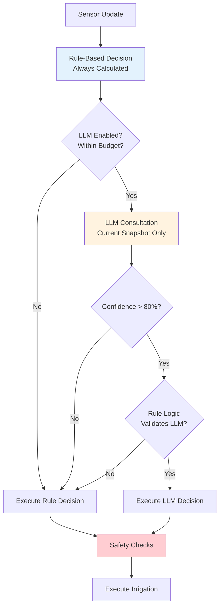

# LLM Integration Guide

**Add cutting-edge AI intelligence to your crop steering system** while maintaining 100% safety through rule-based validation. This guide covers setup, optimization, and cost management for GPT-5 powered decision assistance.

> **Prerequisites**: Complete [full automation setup](../user-guides/02-installation.md#complete-setup) with working AppDaemon before adding LLM features.

## How LLM Integration Actually Works

### The Reality vs The Hype

**✅ What LLM Actually Does**:
- Analyzes current sensor snapshot (VWC, EC, temperature, phase)
- Provides intelligent recommendations: "Irrigate now" or "Wait longer"
- Explains reasoning in natural language
- Considers multiple factors simultaneously (growth stage, environmental conditions)
- Suggests shot size and timing adjustments

**❌ What LLM Does NOT Do**:
- **No persistent memory**: Cannot remember previous decisions or outcomes
- **No learning**: Each API call is completely independent
- **No direct hardware control**: Only provides advisory recommendations
- **No autonomous operation**: Rule-based logic validates and executes all decisions

### Safety-First Architecture



## Cost Reality & Budget Planning

### Honest Cost Expectations

**GPT-5 Model Pricing (2025)**:
- **gpt-5-nano**: $0.05/$0.40 per 1M tokens input/output (ultra cost-effective for routine decisions)
- **gpt-5-mini**: $0.25/$2.00 per 1M tokens input/output (standard analysis)
- **gpt-5**: $1.25/$10.00 per 1M tokens input/output (complex reasoning)

**Typical API Call**:
- Input: 200 tokens (sensor data + prompt)
- Output: 50 tokens (decision + reasoning)
- Total: 250 tokens per decision

**Real Daily Costs**:
```yaml
# Every 5 minutes (conservative)
288 calls/day × 250 tokens × $0.05/1M = $0.36/day

# Every 3 minutes (standard)  
480 calls/day × 250 tokens × $0.05/1M = $0.60/day

# Every 2 minutes (aggressive)
720 calls/day × 250 tokens × $0.05/1M = $0.90/day
```

**With 90% Caching Discount**:
- First week: Full cost while building cache
- After week 1: ~10% of full cost for routine decisions
- Steady state: $0.05-0.15/day for most users

## Setup Guide

### Step 1: Get OpenAI API Access

1. **Create OpenAI Account**: https://platform.openai.com
2. **Add payment method**: Required for API access
3. **Generate API key**: 
   - Go to API Keys section
   - Create new key (starts with `sk-proj-`)
   - Copy and store securely

### Step 2: Configure Home Assistant

1. **Add to secrets.yaml**:
   ```yaml
   # config/secrets.yaml
   openai_api_key: "sk-proj-YOUR_ACTUAL_KEY_HERE"
   ```

2. **Verify security**:
   ```bash
   # Ensure secrets.yaml is in .gitignore
   echo "secrets.yaml" >> .gitignore
   ```

### Step 3: Update AppDaemon Configuration

1. **Edit apps.yaml**:
   ```yaml
   # appdaemon/apps/apps.yaml
   llm_crop_steering:
     module: llm_enhanced_app
     class: LLMEnhancedCropSteering
     
     # Basic Configuration
     zones: [1, 2, 3]  # Your active zones
     
     # LLM Settings
     llm_enabled: true
     llm_provider: "openai"
     model: "gpt-5-nano"
     api_key: !secret openai_api_key
     
     # Budget Control
     daily_budget: 1.00  # Start conservative
     confidence_threshold: 0.8
     
     # Performance Settings
     decision_interval: 300  # 5 minutes
     enable_caching: true
     cache_ttl: 1440  # 24 hours
   ```

2. **Restart AppDaemon**

### Step 4: Verify Installation

1. **Check AppDaemon logs**:
   ```bash
   # Look for:
   [INFO] LLM Enhanced Crop Steering initialized
   [INFO] OpenAI API connection verified
   [INFO] Budget tracker initialized: $1.00/day
   ```

2. **Test LLM consultation**:
   - Wait for next sensor update
   - Check logs for LLM API calls
   - Verify decisions are being made

## Configuration Options

### Budget Tiers

**Economy Tier ($0.50-1.00/day)**:
```yaml
llm_crop_steering:
  model: "gpt-5-nano"
  daily_budget: 1.00
  decision_interval: 600  # 10 minutes
  confidence_threshold: 0.9  # High bar for LLM decisions
  enable_emergency_only: false
```

**Standard Tier ($1.00-3.00/day)**:
```yaml
llm_crop_steering:
  model: "gpt-5-nano"
  enhanced_model: "gpt-5"  # For complex situations
  daily_budget: 3.00
  decision_interval: 180  # 3 minutes
  confidence_threshold: 0.8
  enable_weekly_analysis: true
```

**Premium Tier ($3.00-8.00/day)**:
```yaml
llm_crop_steering:
  model: "gpt-5"
  emergency_model: "gpt-5"
  daily_budget: 8.00
  decision_interval: 120  # 2 minutes
  reasoning_effort: "medium"
  verbosity: "high"
  enable_predictive_analysis: true
```

### Safety Configuration

**Conservative Safety (Recommended)**:
```yaml
safety_config:
  confidence_threshold: 0.85  # High bar for LLM decisions
  emergency_vwc_threshold: 35  # Emergency rule-based irrigation
  max_ec_override: 4.0  # Never irrigate above this EC
  max_consecutive_llm_decisions: 3  # Force rule check periodically
```

**Aggressive AI Usage**:
```yaml
safety_config:
  confidence_threshold: 0.7  # Lower bar, more LLM decisions
  enable_llm_emergency: true  # LLM can handle emergencies
  rule_validation_frequency: 0.5  # Validate 50% of LLM decisions
```

## Optimization Strategies

### Maximize Caching Efficiency

**Cache-Friendly Practices**:
```yaml
caching:
  enabled: true
  ttl_hours: 24
  similarity_threshold: 0.95
  
  # Group similar conditions for better caching
  normalize_readings: true  # Round VWC/EC to nearest 1%
  phase_context_weight: 0.3  # Emphasize phase in similarity
```

**Cache Performance Monitoring**:
```yaml
# Watch these metrics:
sensor.crop_steering_llm_cache_hit_rate  # Target >70%
sensor.crop_steering_llm_daily_cost      # Track spending
sensor.crop_steering_llm_decisions_today # Monitor frequency
```

### Smart Model Selection

**Automatic Model Routing**:
```yaml
model_routing:
  default: "gpt-5-nano"
  
  # Use better models for specific conditions
  complex_conditions:
    - high_ec_ratio: "gpt-5"  # EC > 1.5
    - phase_transition: "gpt-5"  # P0→P1, P2→P3
    - sensor_disagreement: "gpt-5"  # Front/back mismatch
  
  emergency_conditions:
    - critical_vwc: "gpt-5"  # VWC < 30%
    - sensor_failure: "gpt-5"  # Multiple sensors offline
```

### Prompt Optimization

**Efficient Prompt Templates**:
```yaml
prompt_settings:
  complexity: "minimal"  # minimal/standard/detailed
  include_history: false  # Saves tokens
  reasoning_depth: "basic"  # basic/standard/detailed
  
  # Custom prompts for different scenarios
  templates:
    routine_check: "minimal"  # Normal P2 irrigation decisions
    phase_transition: "standard"  # P0→P1 decisions
    emergency: "detailed"  # Critical situations
```

## Monitoring & Analytics

### Real-Time Monitoring

**Key Metrics to Watch**:
```yaml
# Daily Budget Tracking
sensor.crop_steering_llm_daily_cost: $0.45  # Current spending
sensor.crop_steering_llm_daily_budget: $1.00  # Your limit
sensor.crop_steering_llm_budget_remaining: $0.55  # Left today

# Performance Metrics  
sensor.crop_steering_llm_decisions_today: 89  # Total decisions
sensor.crop_steering_llm_confidence_avg: 0.87  # Average confidence
sensor.crop_steering_llm_cache_hit_rate: 73%  # Cache efficiency

# Decision Quality
sensor.crop_steering_llm_vs_rule_agreement: 94%  # How often they agree
sensor.crop_steering_llm_overrides_today: 3  # Rule-based overrides
```

### Performance Dashboard

**Add to your dashboard**:
```yaml
type: vertical-stack
cards:
  - type: entities
    title: "AI Decision Assistant"
    entities:
      - entity: switch.crop_steering_llm_enabled
        name: "AI Enabled"
      - entity: sensor.crop_steering_llm_daily_cost
        name: "Daily Cost"
      - entity: sensor.crop_steering_llm_confidence_avg
        name: "Avg Confidence"
      - entity: sensor.crop_steering_llm_cache_hit_rate
        name: "Cache Hit Rate"
  
  - type: history-graph
    title: "AI vs Rule Decisions"
    entities:
      - sensor.crop_steering_llm_decisions_today
      - sensor.crop_steering_rule_decisions_today
    hours_to_show: 24
  
  - type: gauge
    title: "Daily Budget Usage"
    entity: sensor.crop_steering_llm_daily_cost
    min: 0
    max: 1.0  # Your daily budget
    severity:
      green: 0
      yellow: 0.7
      red: 0.9
```

## Advanced Features

### Weekly Analysis Reports

**Enable Detailed Analytics**:
```yaml
weekly_analysis:
  enabled: true
  model: "gpt-5"  # More capable model for analysis
  schedule: "sunday 23:00"  # Weekly at 11 PM Sunday
  
  analysis_includes:
    - irrigation_efficiency_trends
    - sensor_performance_analysis
    - parameter_optimization_suggestions
    - plant_response_correlation
```

**Sample Weekly Report**:
```
Week of Jan 15-21, 2024
Total Irrigation Events: 156
AI Decisions: 89 (57%)
Rule-based Decisions: 67 (43%)

Key Insights:
- Zone 2 showing 15% higher water usage than optimal
- EC ratio trending upward, suggest nutrient adjustment
- P1→P2 transitions occurring 20 min earlier than target
- VWC sensor front/back disagreement in Zone 3 increasing

Recommendations:
- Reduce Zone 2 shot size from 5% to 4.5%
- Lower nutrient concentration by 10%
- Adjust P1 target VWC from 65% to 62%
- Calibrate Zone 3 VWC sensors
```

### Predictive Decision Making

**Weather Integration**:
```yaml
predictive_features:
  weather_integration: true
  weather_api_key: !secret weather_api_key
  
  # Consider weather in decisions
  factors:
    - upcoming_humidity_changes
    - temperature_forecasts
    - atmospheric_pressure_trends
  
  # Adjust irrigation based on predictions
  adjustments:
    high_humidity_forecast: "reduce_shot_size"
    temperature_drop_expected: "increase_frequency"
```

## Troubleshooting LLM Issues

### High Costs

**Immediate Actions**:
1. **Check call frequency**: May be calling too often
2. **Verify caching**: Cache hit rate should be >60%
3. **Review model usage**: Ensure using gpt-5-nano for routine decisions
4. **Set stricter budget**: Lower daily limit

**Configuration Fixes**:
```yaml
# Reduce costs:
decision_interval: 600  # Less frequent calls
confidence_threshold: 0.9  # Higher bar for LLM usage
enable_emergency_only: true  # LLM only for critical decisions
```

### Low LLM Usage

**Symptoms**: LLM rarely making decisions, mostly rule-based

**Causes & Solutions**:
1. **Budget exceeded**: Check daily spending limit
2. **Confidence too low**: Reduce confidence threshold
3. **API errors**: Check API key and OpenAI account status
4. **Caching too aggressive**: Reduce cache TTL

### Poor Decision Quality

**If LLM makes bad decisions**:
1. **Check sensor data quality**: Garbage in, garbage out
2. **Review prompt templates**: May need more context
3. **Adjust confidence threshold**: Increase to be more selective
4. **Enable rule validation**: Force more rule-based checking

## Cost Optimization Checklist

### Daily Optimization
- [ ] Monitor daily spending vs budget
- [ ] Check cache hit rate (target >70%)
- [ ] Review decision frequency
- [ ] Verify model selection is appropriate

### Weekly Review
- [ ] Analyze LLM vs rule decision quality
- [ ] Adjust confidence thresholds based on performance
- [ ] Review and adjust budget if needed
- [ ] Check for any API errors or issues

### Monthly Optimization
- [ ] Generate comprehensive analytics report
- [ ] Compare costs vs benefits achieved
- [ ] Fine-tune prompt templates
- [ ] Update safety thresholds based on plant response

## Migration from Rule-Only System

### Gradual Rollout Strategy

**Week 1: Testing Mode**
```yaml
llm_crop_steering:
  llm_enabled: true
  daily_budget: 0.50  # Very conservative
  confidence_threshold: 0.95  # Almost never use LLM
  decision_interval: 1200  # Every 20 minutes
```

**Week 2: Conservative Usage**
```yaml
llm_crop_steering:
  daily_budget: 1.00
  confidence_threshold: 0.85
  decision_interval: 600  # Every 10 minutes
```

**Week 3+: Standard Operation**
```yaml
llm_crop_steering:
  daily_budget: 2.00
  confidence_threshold: 0.8
  decision_interval: 300  # Every 5 minutes
```

### Rollback Plan

**If LLM causes issues**:
1. **Immediate**: Set `llm_enabled: false`
2. **Restart AppDaemon** to return to rule-based operation
3. **Analyze logs** to understand what went wrong
4. **Fix configuration** before re-enabling

---

**🤖 LLM Integration Complete!** Start conservative and gradually increase usage as you build confidence in the system. Remember: the rule-based logic is always there as a safety net.