# Crop Steering System: Complete Documentation

## Table of Contents

1. [System Overview](#system-overview)
2. [System Architecture](#system-architecture)
3. [Component Relationships](#component-relationships)
4. [Data Flow Map](#data-flow-map)
5. [Logic Flow by Phase](#logic-flow-by-phase)
   - [P0: Pre-Irrigation Dry Back](#p0-pre-irrigation-dry-back)
   - [P1: Ramp-Up Phase](#p1-ramp-up-phase)
   - [P2: Maintenance Phase](#p2-maintenance-phase)
   - [P3: Overnight Dry Back](#p3-overnight-dry-back)
6. [Zone Control Logic](#zone-control-logic)
7. [EC Adjustment Logic](#ec-adjustment-logic)
8. [Dryback Detection System](#dryback-detection-system)
9. [Configuration Blueprint System](#configuration-blueprint-system)
10. [EC Stacking Automation](#ec-stacking-automation)
11. [Dashboard Integration](#dashboard-integration)
12. [Complete Entity Relationship Map](#complete-entity-relationship-map)
13. [Troubleshooting Guide](#troubleshooting-guide)

## System Overview

The Crop Steering system is designed to manage irrigation for growing operations using principles of precision agriculture. It implements a four-phase approach to irrigation control, with each phase optimized for different periods in the plant's daily growth cycle.

### Core Principles

1. **Precision Irrigation**: Deliver exactly the right amount of water at the right time
2. **EC Management**: Balance nutrient concentration through irrigation timing and duration
3. **Dryback Control**: Monitor and manage substrate moisture levels through calculated dry periods
4. **Zone-Specific Control**: Manage multiple growing zones with individual sensors and controls
5. **Growth Mode Switching**: Toggle between vegetative and generative modes with appropriate parameter adjustments

### System Goals

- Maximize root zone oxygen levels
- Prevent over-saturation or excessive dryness
- Maintain optimal EC levels in the root zone
- Create appropriate stress for vegetative or generative growth
- Ensure reliable, automated irrigation control

## System Architecture

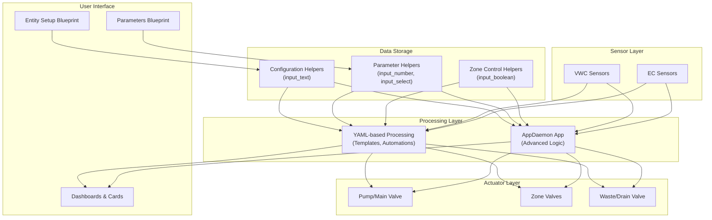

The architecture follows a layered approach with clear separation between:
- User configuration (blueprints)
- Data storage (Home Assistant helpers)
- Processing (YAML templates and AppDaemon)
- Sensors and actuators (physical devices)

## Component Relationships

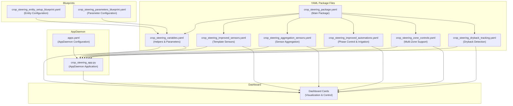

## Data Flow Map

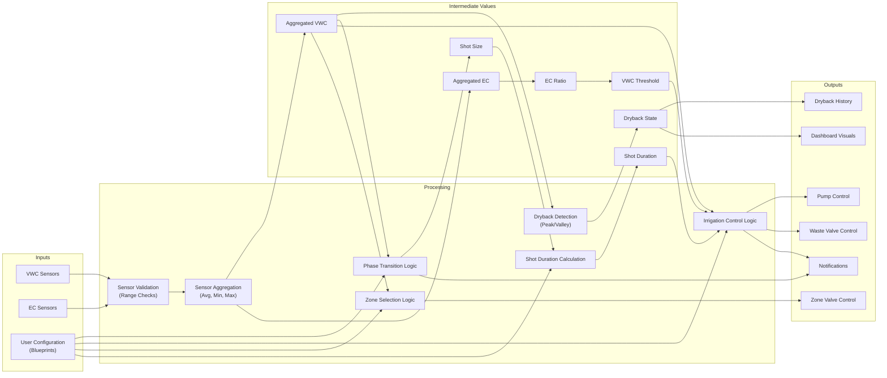

## Logic Flow by Phase

### P0: Pre-Irrigation Dry Back

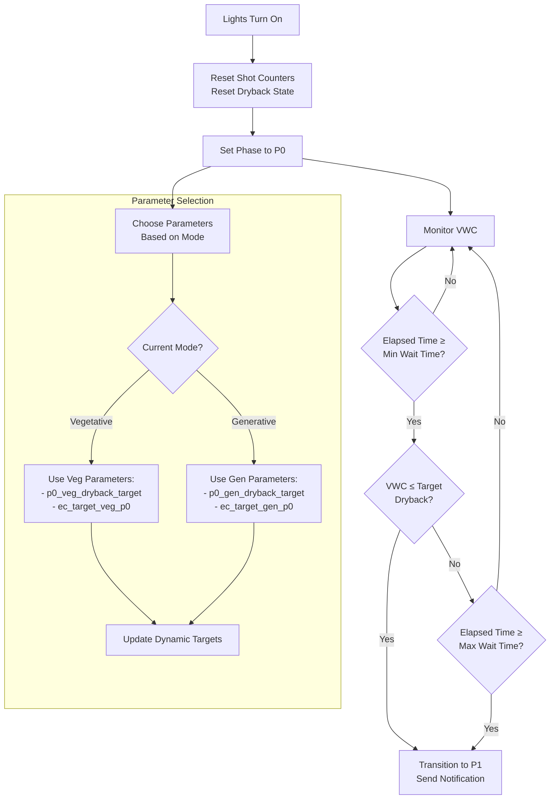

### P1: Ramp-Up Phase

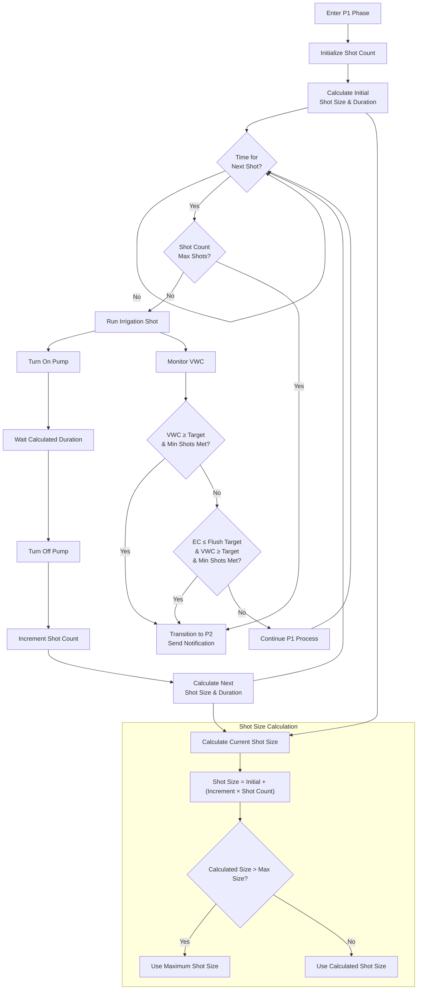

### P2: Maintenance Phase

```mermaid
flowchart TD
    START[Enter P2 Phase] --> INIT[Initialize P2 Settings]
    INIT --> CALC_THRESHOLD[Calculate EC-Adjusted<br>VWC Threshold]
    CALC_THRESHOLD --> MONITOR_VWC[Monitor VWC]

    MONITOR_VWC --> CHECK_VWC{VWC < Adjusted<br>Threshold?}
    CHECK_VWC -- No --> P3_TIME_CHECK{Time to<br>Transition to P3?}
    P3_TIME_CHECK -- No --> MONITOR_VWC
    P3_TIME_CHECK -- Yes --> TRANSITION_P3[Transition to P3<br>Send Notification]

    CHECK_VWC -- Yes --> CHECK_MAX_EC{EC > Max Safe EC?}
    CHECK_MAX_EC -- Yes --> SKIP_HIGH_EC["Skip Irrigation\n(High EC Safety)"]
    SKIP_HIGH_EC --> MONITOR_VWC
    CHECK_MAX_EC -- No --> CHECK_PUMP{"Pump\nAlready On?"}
    CHECK_PUMP -- Yes --> MONITOR_VWC
    CHECK_PUMP -- No --> RUN_SHOT[Start Irrigation]

    RUN_SHOT --> PUMP_ON[Turn On Pump]
    PUMP_ON --> WAIT[Wait Calculated Duration]
    WAIT --> PUMP_OFF[Turn Off Pump]
    PUMP_OFF --> INCREMENT[Increment P2 Shot Count]
    INCREMENT --> MONITOR_VWC

    MONITOR_VWC --> CHECK_CAPACITY{VWC ≥ Field<br>Capacity?}
    CHECK_CAPACITY -- Yes --> STOP_EARLY[Stop Irrigation<br>Turn Off Pump]
    STOP_EARLY --> MONITOR_VWC

    subgraph "EC Adjustment Logic"
        CALC_ADJ[Calculate EC-Adjusted VWC Threshold]
        CHECK_RATIO{EC Ratio?}
        CHECK_RATIO -- > High Threshold --> HIGH_ADJ[Increase VWC Threshold<br>by High EC Adjustment]
        CHECK_RATIO -- < Low Threshold --> LOW_ADJ[Decrease VWC Threshold<br>by Low EC Adjustment]
        CHECK_RATIO -- Between Thresholds --> NO_ADJ[Use Base VWC Threshold]
        CALC_ADJ --> CHECK_RATIO
        HIGH_ADJ --> APPLY_STACKING
        LOW_ADJ --> APPLY_STACKING
        NO_ADJ --> APPLY_STACKING
        APPLY_STACKING{EC Stacking Active?}
        APPLY_STACKING -- Yes --> STACK_ADJ[Apply Stacking<br>VWC Reduction]
    APPLY_STACKING -- No --> FINAL_THRESHOLD["Final Adjusted Threshold"]
    STACK_ADJ --> FINAL_THRESHOLD
    end

    CALC_THRESHOLD --> CALC_ADJ

    subgraph "Zone-Specific Logic (Simplified for Diagram)"
        ZONE_CHECK["Check Each Zone's VWC"]
        ZONE_ACTIVE{"Any Active Zone\nBelow Threshold?"}
        ZONE_ACTIVE -- Yes --> SELECTED_ZONES["Update Active Zones\nfor Irrigation"]
        ZONE_ACTIVE -- No --> SKIP_IRR["Skip Irrigation"]
        ZONE_CHECK --> ZONE_ACTIVE
    end

    CHECK_VWC -- Yes --> ZONE_CHECK # Check zones if VWC is low enough
    SELECTED_ZONES --> CHECK_MAX_EC # If zones selected, proceed
```

### P3: Overnight Dry Back

```mermaid
flowchart TD
    START[Enter P3 Phase] --> INIT[Initialize P3 Settings]
    INIT --> MONITOR_VWC[Monitor Minimum VWC]

    MONITOR_VWC --> CHECK_VWC{Min VWC < Emergency<br>Threshold?}
    CHECK_VWC -- No --> LIGHTS_ON_CHECK{Lights On Time<br>Reached?}
    LIGHTS_ON_CHECK -- No --> MONITOR_VWC
    LIGHTS_ON_CHECK -- Yes --> TRANSITION_P0[Transition to P0<br>New Day Cycle]

    CHECK_VWC -- Yes --> CHECK_PUMP{"Pump\nAlready On?"}
    CHECK_PUMP -- Yes --> MONITOR_VWC
    CHECK_PUMP -- No --> RUN_EMERGENCY["Run Emergency Irrigation"]

    RUN_EMERGENCY --> PUMP_ON[Turn On Pump]
    PUMP_ON --> WAIT[Wait Emergency<br>Shot Duration]
    WAIT --> PUMP_OFF[Turn Off Pump]
    PUMP_OFF --> INCREMENT[Increment P3 Shot Count]
    INCREMENT --> NOTIFY[Send Emergency<br>Irrigation Notification]
    NOTIFY --> MONITOR_VWC

    subgraph "P3 Start Time Calculation"
        CALC_START[Calculate P3 Start Time]
        MODE_CHECK{Current Mode?}
        MODE_CHECK -- Vegetative --> VEG_TIME[Lights Off Time -<br>p3_veg_last_irrigation]
        MODE_CHECK -- Generative --> GEN_TIME[Lights Off Time -<br>p3_gen_last_irrigation]
        CALC_START --> MODE_CHECK
    end

    subgraph "Zone-Specific Logic (Simplified for Diagram)"
        ZONE_CHECK_EM["Check Each Zone's VWC"]
        ZONE_ACTIVE_EM{"Any Active Zone\nBelow Emergency\nThreshold?"}
        ZONE_ACTIVE_EM -- Yes --> SELECTED_ZONES_EM["Update Active Zones\nfor Emergency Irrigation"]
        ZONE_ACTIVE_EM -- No --> SKIP_IRR_EM["Skip Irrigation"]
        ZONE_CHECK_EM --> ZONE_ACTIVE_EM
    end

    CHECK_VWC -- Yes --> ZONE_CHECK_EM # Check zones if VWC is low enough
    SELECTED_ZONES_EM --> RUN_EMERGENCY # If zones selected, proceed
```

## Zone Control Logic

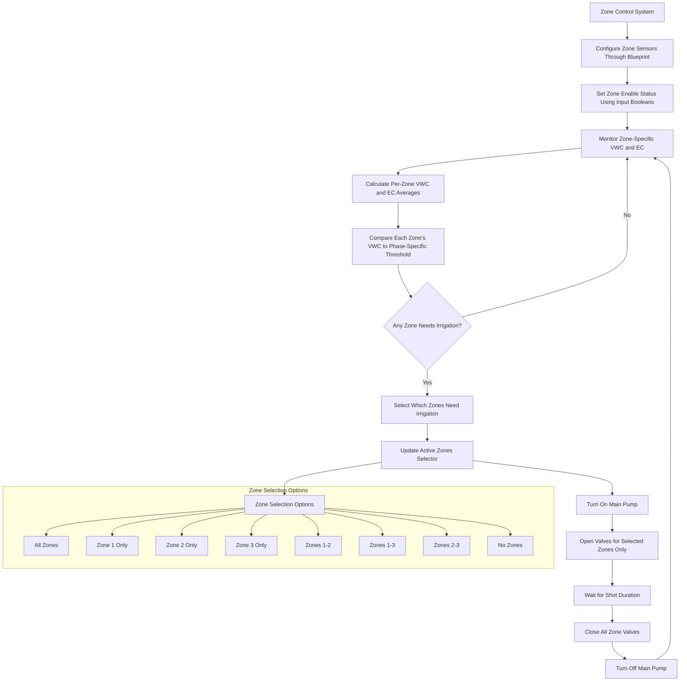

## EC Adjustment Logic

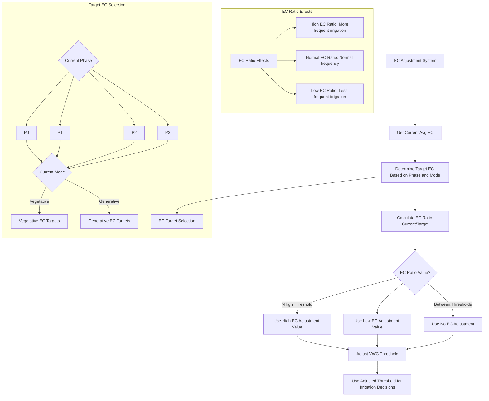

## Dryback Detection System

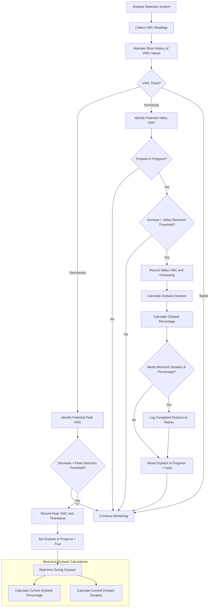

## Configuration Blueprint System

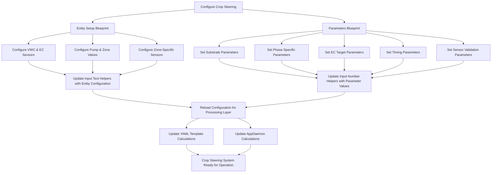

## EC Stacking Automation

This feature allows for the deliberate accumulation of EC in the substrate during specific phases, typically early flower, to promote generative growth.

### How it Works (AppDaemon Implementation)

1.  **Enable Feature**: Toggle `input_boolean.cs_ec_stacking_enabled` to `on`.
2.  **Configure Active Phases**: Set `input_text.cs_ec_stacking_active_phases` to a comma-separated list of phases where stacking should occur (e.g., "P1,P2" or just "P2").
3.  **Set Target Ratio**: Define the desired EC ratio (Substrate EC / Target EC) using `input_number.cs_ec_stacking_target_ratio`. A value of 1.5 means you want the substrate EC to be 50% higher than the normal target for that phase.
4.  **Set VWC Reduction**: Configure `input_number.cs_ec_stacking_vwc_reduction`. This value (in %) reduces the VWC threshold that triggers irrigation during P2.

### Logic

- When EC Stacking is enabled AND the current phase is one of the active phases AND the current EC Ratio is *below* the target stacking ratio:
    - The AppDaemon script will subtract the `cs_ec_stacking_vwc_reduction` value from the calculated P2 VWC irrigation threshold.
    - This makes the system wait for the substrate to dry out slightly more before triggering irrigation, allowing EC to accumulate or "stack".
- **Safety Override**: Irrigation is always skipped if the average substrate EC exceeds the `cs_substrate_max_ec` value, regardless of stacking settings.

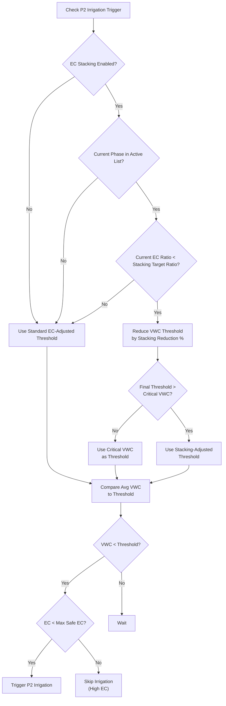

## Dashboard Integration

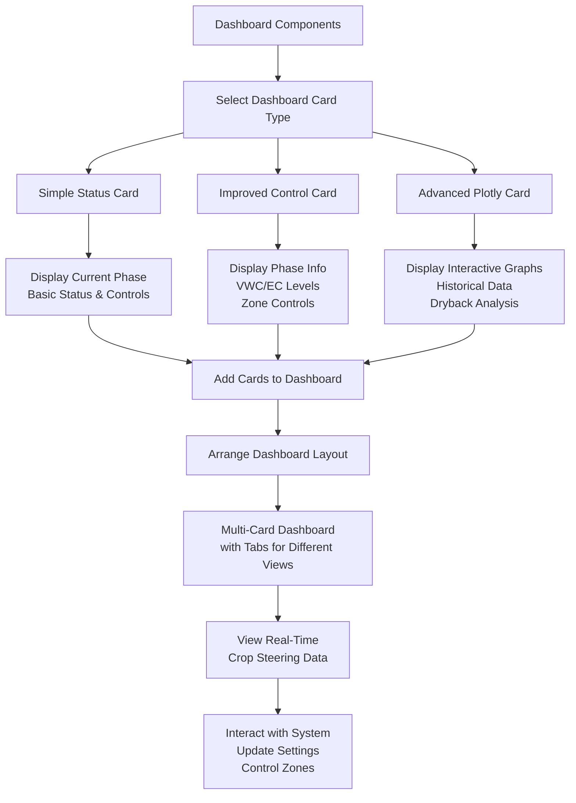

## Complete Entity Relationship Map

This diagram shows how all entities in the system relate to each other, focusing on the most important connections.

```mermaid
flowchart TB
    classDef input fill:#f9f,stroke:#333,stroke-width:2px
    classDef helper fill:#bbf,stroke:#333,stroke-width:2px
    classDef sensor fill:#bfb,stroke:#333,stroke-width:2px
    classDef switch fill:#ff9,stroke:#333,stroke-width:2px
    classDef automation fill:#f90,stroke:#333,stroke-width:2px

    %% Input Entities (Physical Sensors)
    InputVWC["Raw VWC Sensors"]:::input
    InputEC["Raw EC Sensors"]:::input
    InputZoneVWC["Zone VWC Sensors"]:::input
    InputZoneEC["Zone EC Sensors"]:::input

    %% Helper Entities (User Configuration & State)
    PhaseSelect["input_select.cs_crop_steering_phase"]:::helper
    ModeSelect["input_select.cs_steering_mode"]:::helper
    ZonesSelect["input_select.active_irrigation_zones"]:::helper
    P1ShotCount["input_number.cs_p1_shot_count"]:::helper
    P2ShotCount["input_number.cs_p2_shot_count"]:::helper
    P3ShotCount["input_number.cs_p3_shot_count"]:::helper
    ZoneEnabledBooleans["Zone Enable\nInput Booleans"]:::helper
    ECStackingEnabled["input_boolean.cs_ec_stacking_enabled"]:::helper
    ECStackingParams["EC Stacking Parameters\n(input_number, input_text)"]:::helper
    ConfigHelpers["Config Helpers\n(input_text storing blueprint selections)"]:::helper
    ParamHelpers["Parameter Helpers\n(input_numbers storing blueprint selections)"]:::helper

    %% Sensor Entities (Calculated/Template)
    AvgVWC["sensor.cs_configured_avg_vwc"]:::sensor
    AvgEC["sensor.cs_configured_avg_ec"]:::sensor
    MinVWC["sensor.cs_configured_min_vwc"]:::sensor
    MaxVWC["sensor.cs_configured_max_vwc"]:::sensor
    ECRatio["sensor.cs_ec_ratio"]:::sensor
    AdjustedThreshold["sensor.cs_p2_vwc_threshold_ec_adjusted"]:::sensor
    ZoneVWCSensors["Zone VWC Sensors (Template)"]:::sensor
    ZoneECSensors["Zone EC Sensors (Template)"]:::sensor
    ShotDurations["Shot Duration Sensors"]:::sensor
    DrybackSensors["Dryback Status Sensors"]:::sensor

    %% Switch Entities (Actuators)
    PumpSwitch["switch.cs_configured_pump_switch"]:::switch
    ZoneValves["Zone Valve Switches (Template)"]:::switch
    WasteValve["Waste Valve Switch (Template)"]:::switch

    %% Automations (Logic Controllers)
    PhaseTransition["Phase Transition Automations"]:::automation
    IrrigationControl["Irrigation Control Automations"]:::automation
    ZoneControl["Zone Control Automations"]:::automation
    DrybackDetection["Dryback Detection Logic"]:::automation
    BlueprintEntity["Entity Setup Blueprint Automation"]:::automation
    BlueprintParam["Parameter Setup Blueprint Automation"]:::automation

    %% Connections
    BlueprintEntity --> ConfigHelpers
    BlueprintParam --> ParamHelpers

    ConfigHelpers --> AvgVWC
    ConfigHelpers --> AvgEC
    ConfigHelpers --> MinVWC
    ConfigHelpers --> MaxVWC
    ConfigHelpers --> PumpSwitch
    ConfigHelpers --> ZoneValves
    ConfigHelpers --> WasteValve
    ConfigHelpers --> ZoneVWCSensors
    ConfigHelpers --> ZoneECSensors

    ParamHelpers --> PhaseTransition
    ParamHelpers --> IrrigationControl
    ParamHelpers --> ZoneControl
    ParamHelpers --> DrybackDetection
    ParamHelpers --> AdjustedThreshold
    ParamHelpers --> ShotDurations

    InputVWC --> ConfigHelpers
    InputEC --> ConfigHelpers
    InputZoneVWC --> ConfigHelpers
    InputZoneEC --> ConfigHelpers

    AvgVWC --> PhaseTransition
    AvgVWC --> IrrigationControl
    AvgVWC --> DrybackDetection
    AvgEC --> ECRatio
    MinVWC --> IrrigationControl
    ECRatio --> AdjustedThreshold
    AdjustedThreshold --> IrrigationControl
    ZoneVWCSensors --> ZoneControl
    ShotDurations --> IrrigationControl

    PhaseSelect --> PhaseTransition
    PhaseSelect --> IrrigationControl
    ModeSelect --> PhaseTransition
    ZonesSelect --> ZoneControl
    P1ShotCount --> IrrigationControl
    P2ShotCount --> IrrigationControl
    P3ShotCount --> IrrigationControl
    ZoneEnabledBooleans --> ZoneControl
    ECStackingEnabled --> IrrigationControl
    ECStackingParams --> IrrigationControl

    PhaseTransition --> PhaseSelect
    IrrigationControl --> PumpSwitch
    ZoneControl --> ZoneValves
    IrrigationControl --> WasteValve
    DrybackDetection --> DrybackSensors
    ZoneControl --> ZonesSelect
```

## Troubleshooting Guide

### Common Issues and Solutions

#### 1. Irrigation Not Triggering

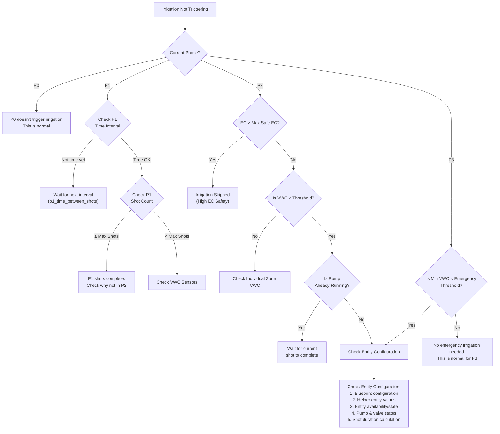

#### 2. Phase Not Progressing

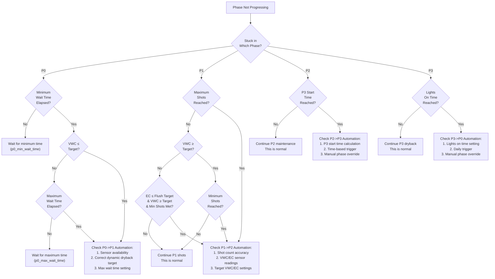

#### 3. Dryback Detection Issues

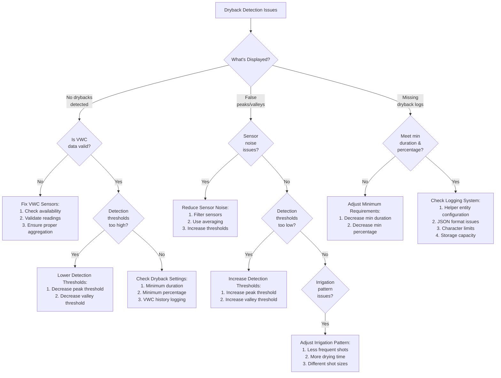

### Parameter Troubleshooting Table

| Parameter Type | Common Issues | Potential Solutions |
|----------------|--------------|---------------------|
| VWC Settings | • Thresholds too high/low<br>• Substrate params incorrect | • Calibrate to substrate<br>• Test with different values |
| EC Settings | • Targets not matching nutrient solution<br>• Ratio thresholds too tight/loose | • Match EC target to nutrient soln<br>• Adjust ratio thresholds for sensitivity |
| Shot Sizes | • Too large/small<br>• Increment too aggressive | • Base on substrate volume<br>• Start small and increase conservatively |
| Timing | • Lights schedule incorrect<br>• P3 transition too early/late | • Verify actual light timing<br>• Adjust P3 timing offsets |
| Duration | • Shot duration too short/long<br>• Flow rate incorrect | • Verify actual flow rate<br>• Adjust substrate volume value |
| EC Stacking | • Stacking not activating<br>• Stacking too aggressive | • Check enable toggle & active phases<br>• Verify EC ratio < target ratio<br>• Adjust target ratio or VWC reduction |

## Final Implementation Notes

1. **Start Simple**: Begin with conservative parameters and a single zone before expanding.

2. **Calibration Period**: Allow 3-7 days for full calibration of parameters to your specific environment.

3. **Monitoring Priority**: Focus on:
   - Average VWC trend over time
   - EC stability and ratio
   - Dryback percentage achieved
   - Shot timing and frequency

4. **Season Adjustments**: Be prepared to adjust parameters as:
   - Plants mature
   - Environmental conditions change
   - Growth objectives shift

5. **Safety Mechanisms**: The system includes several safety features:
   - Sensor validation filters
   - Field capacity cutoff
   - P3 emergency irrigation
   - Zone-specific monitoring
   - Max EC irrigation cutoff

6. **Data Analysis**: Use the plotly graphs to analyze:
   - VWC curves
   - EC trends
   - Irrigation timing
   - Dryback patterns

7. **Documentation**: Keep records of:
   - Parameter changes
   - Growth responses
   - Unusual events
   - Seasonal adjustments

For additional support, refer to the installation guide and system analysis documents.
