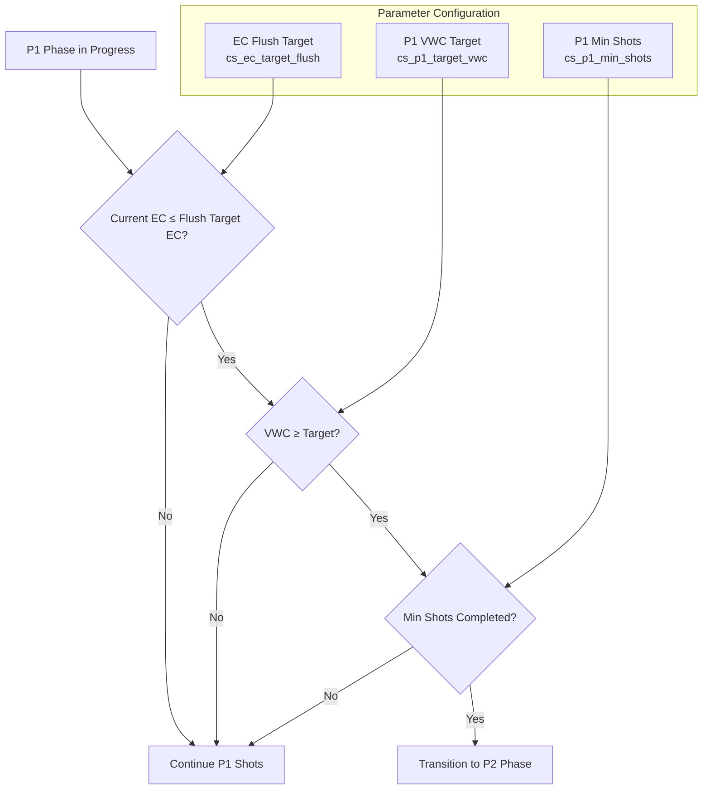

# P1 to P2 Transition: EC Reset Mechanism

The transition from P1 (Ramp-Up Phase) to P2 (Maintenance Phase) is a critical stage in the crop steering system. While VWC reaching target level is the primary trigger, there is also an important EC-based condition that can initiate this transition. This document explains this "EC Reset" condition in detail.

## Transition Conditions Overview

The system transitions from P1 to P2 under any of these conditions:

1. **Maximum Shots Condition**: P1 shot count reaches the configured maximum (`cs_p1_max_shots`)
2. **VWC Target Condition**: Average VWC reaches the target (`cs_p1_target_vwc`) AND minimum shots (`cs_p1_min_shots`) have been completed
3. **EC Reset Condition**: EC drops below flush target (`cs_ec_target_flush`) AND VWC is at or above target AND minimum shots have been completed

## EC Reset Mechanism Details

### Purpose

The EC Reset mechanism serves multiple important functions:

1. **Substrate Flush**: It provides a way to transition to P2 after a successful reset of EC levels in the substrate
2. **Salt Accumulation Prevention**: It helps prevent buildup of salts in the growing medium
3. **Fresh Nutrient Profile**: It allows for establishing a cleaner baseline nutrient profile in the substrate

### How It Works



### EC Reset Implementation Details

This condition is implemented in both YAML automations and the AppDaemon app:

1. **YAML Implementation**:
   ```yaml
   # From crop_steering_improved_automations.yaml
   - conditions:
       # EC below flush target
       - condition: numeric_state
         entity_id: sensor.cs_configured_avg_ec
         below: input_number.cs_ec_target_flush
       # VWC above P1 target VWC
       - condition: numeric_state
         entity_id: sensor.cs_configured_avg_vwc
         above: input_number.cs_p1_target_vwc
       # Minimum shots reached
       - condition: numeric_state
         entity_id: input_number.cs_p1_shot_count
         above: "{{ states('input_number.cs_p1_min_shots') | int -1 }}"
     sequence:
       - service: input_select.select_option
         target:
           entity_id: input_select.cs_crop_steering_phase
         data:
           option: P2
   ```

2. **AppDaemon Implementation**:
   ```python
   # From crop_steering_app.py
   elif target_vwc_reached and min_shots_ok:
       self.log(f"P1->P2: Target VWC ({target_vwc}%) reached after min shots ({min_shots}). VWC: {self.avg_vwc}%.")
       self.set_phase(P2)
   elif ec_condition_met and target_vwc_reached and min_shots_ok:
       self.log(f"P1->P2: EC condition (<= {flush_ec_target}) met, VWC >= {target_vwc}%, and min shots ({min_shots}) reached. EC: {self.avg_ec}, VWC: {self.avg_vwc}%.")
       self.set_phase(P2)
   ```

### Configuration Parameters

These parameters control the EC Reset behavior:

| Parameter | Description | Typical Value | Comments |
|-----------|-------------|---------------|----------|
| `cs_ec_target_flush` | Target EC level for flushing | 0.8 mS/cm | Lower value means more flushing |
| `cs_p1_target_vwc` | Target VWC to reach in P1 | 30% | Must also be met for EC-based transition |
| `cs_p1_min_shots` | Minimum shots before any transition | 3 | Prevents too-early transitions |

### Real-World Application

This EC-based transition is especially useful in these scenarios:

1. **Salt Buildup**: When EC levels have become too high and need to be reduced
2. **Changing Nutrient Regimen**: When switching to a different nutrient profile
3. **Correcting Imbalances**: When pH or specific nutrient imbalances need to be fixed
4. **Crop Stress Management**: When plants need stress relief through substrate flushing

## Optimization Tips

1. **Flush Target Balance**: Setting the flush target too low may make this transition difficult to achieve, while setting it too high may trigger it too easily.

2. **Paired with VWC Target**: Remember that both conditions (EC and VWC) must be met together with the minimum shot count.

3. **Monitoring**: Watch for this transition reason in your logs to understand your substrate's EC behavior.

4. **Adjusting**: If you never see this transition trigger, your flush target may be too low; if it triggers too often, consider raising it.

5. **Strategic Use**: Some growers intentionally force this condition by running clear water to achieve a controlled flush and transition.
