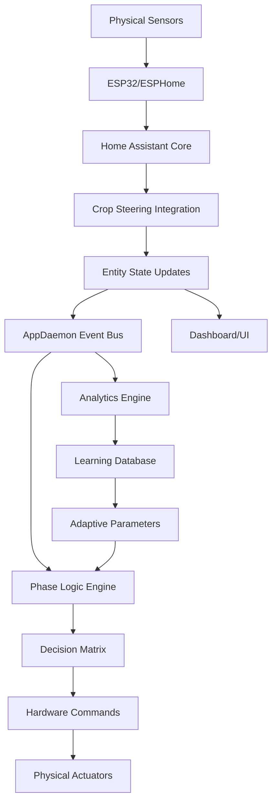
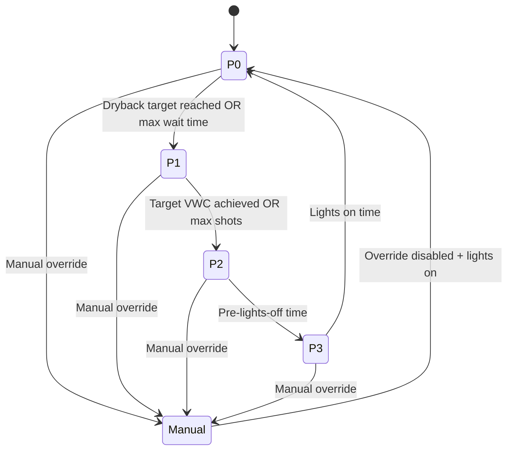

# System Architecture

**Comprehensive technical overview** of the Crop Steering System architecture, components, and data flow.

> **For Developers**: This document provides technical implementation details for understanding system design and contributing to development.

## Overview

The Crop Steering System is a two-layer architecture combining a Home Assistant integration with optional AppDaemon automation modules for autonomous irrigation control.

### Architecture Principles
- **Separation of Concerns**: UI/monitoring (HA) vs automation logic (AppDaemon)
- **Fail-Safe Design**: Manual override capabilities at every level
- **Extensibility**: Modular components for easy feature addition
- **Data Integrity**: Comprehensive validation and safety checks
- **Real-time Responsiveness**: Sub-second safety shutoffs

## System Components

### Layer 1: Home Assistant Integration

```
┌─────────────────────────────────────────────────────────────┐
│                Home Assistant Integration                    │
├─────────────────────────────────────────────────────────────┤
│  Config Flow        │  Entities           │  Services       │
│  ├─ Setup Wizard    │  ├─ Sensors         │  ├─ Phase Mgmt  │
│  ├─ Entity Mapping  │  ├─ Numbers         │  ├─ Irrigation  │
│  └─ Zone Config     │  ├─ Selects         │  └─ Override    │
│                     │  └─ Switches        │                 │
├─────────────────────────────────────────────────────────────┤
│                    Core Functions                           │
│  ├─ Shot Duration Calculations                              │
│  ├─ EC Ratio Processing                                     │
│  ├─ Safety Validation                                       │
│  └─ Event Generation                                        │
└─────────────────────────────────────────────────────────────┘
```

**Purpose**: 
- Provides 100+ entities for monitoring and control
- Handles hardware abstraction and safety validation
- Manages configuration through UI
- Offers manual control capabilities

**Location**: `custom_components/crop_steering/`

### Layer 2: AppDaemon Automation

```
┌─────────────────────────────────────────────────────────────┐
│                   AppDaemon Automation                      │
├─────────────────────────────────────────────────────────────┤
│  Master Controller  │  Phase Logic        │  Analytics      │
│  ├─ State Machine   │  ├─ P0: Dryback     │  ├─ Statistics  │
│  ├─ Safety Monitor  │  ├─ P1: Ramp-up     │  ├─ Efficiency  │
│  └─ Event Handler   │  ├─ P2: Maintenance │  └─ Predictive  │
│                     │  └─ P3: Pre-off     │                 │
├─────────────────────────────────────────────────────────────┤
│  Learning System    │  Hardware Control   │  External APIs  │
│  ├─ Field Capacity  │  ├─ Pump Sequencing │  ├─ LLM (opt)   │
│  ├─ Efficiency Map  │  ├─ Valve Control   │  ├─ Weather     │
│  └─ Adaptation      │  └─ Safety Interlocks│  └─ Telemetry   │
└─────────────────────────────────────────────────────────────┘
```

**Purpose**:
- Autonomous 4-phase operation
- Advanced analytics and learning
- Hardware sequencing and safety
- External API integration

**Location**: `appdaemon/apps/crop_steering/`

## Data Flow Architecture

### Real-Time Data Pipeline



### Data Transformation Stages

#### Stage 1: Sensor Preprocessing
```python
# In Home Assistant Integration
raw_vwc_front = sensor.zone_1_vwc_front.state
raw_vwc_back = sensor.zone_1_vwc_back.state

# Validation and averaging
if validate_sensor_reading(raw_vwc_front, raw_vwc_back):
    avg_vwc = (raw_vwc_front + raw_vwc_back) / 2
    update_entity("sensor.crop_steering_vwc_zone_1", avg_vwc)
```

#### Stage 2: Decision Logic
```python
# In AppDaemon Master Controller
current_vwc = get_state("sensor.crop_steering_vwc_zone_1")
current_phase = get_state("sensor.crop_steering_current_phase")
vwc_threshold = get_state("number.crop_steering_p2_vwc_threshold")

if current_phase == "P2" and current_vwc < vwc_threshold:
    initiate_irrigation_sequence(zone=1, phase="P2")
```

#### Stage 3: Hardware Execution
```python
# Hardware sequence with safety checks
def execute_irrigation_shot(zone, duration):
    if safety_check_passed():
        activate_pump()           # 2 second prime
        wait(2)
        activate_main_valve()     # 1 second stabilization
        wait(1)
        activate_zone_valve(zone) # Open target zone
        wait(duration)            # Irrigation period
        deactivate_all()          # Safety shutdown
```

## Phase State Machine

### State Definitions

```python
class IrrigationPhase(Enum):
    P0_DRYBACK = "P0"      # Morning dryback detection
    P1_RAMPUP = "P1"       # Progressive recovery shots
    P2_MAINTENANCE = "P2"   # Threshold-based irrigation
    P3_PREOFF = "P3"       # Pre-lights-off preparation
    MANUAL = "Manual"       # Manual override mode
```

### Transition Logic



### Transition Conditions

```python
def check_transition_conditions(current_phase):
    conditions = {
        "P0": {
            "to_P1": [
                check_dryback_percentage(),
                check_max_wait_time(),
                check_emergency_vwc()
            ]
        },
        "P1": {
            "to_P2": [
                check_target_vwc_reached(),
                check_max_shots_delivered(),
                check_lights_off_approaching()
            ]
        },
        "P2": {
            "to_P3": [
                check_pre_lights_off_time()
            ]
        },
        "P3": {
            "to_P0": [
                check_lights_on_time()
            ]
        }
    }
    return evaluate_conditions(conditions[current_phase])
```

## Safety Architecture

### Multi-Layer Safety System

```
┌─────────────────────────────────────────────────────────────┐
│                     Safety Layers                          │
├─────────────────────────────────────────────────────────────┤
│ Layer 1: Hardware Interlocks                               │
│ ├─ Physical flow sensors                                   │
│ ├─ Pressure relief valves                                  │
│ └─ Emergency stop switches                                 │
├─────────────────────────────────────────────────────────────┤
│ Layer 2: Home Assistant Integration                        │
│ ├─ Entity validation                                       │
│ ├─ Duration limits (max 300s/shot)                        │
│ ├─ VWC bounds checking (0-100%)                           │
│ └─ EC limits (configurable max)                           │
├─────────────────────────────────────────────────────────────┤
│ Layer 3: AppDaemon Logic                                   │
│ ├─ Phase transition validation                             │
│ ├─ Rate limiting (max shots/hour)                         │
│ ├─ Sensor health monitoring                               │
│ └─ System state coherence                                 │
├─────────────────────────────────────────────────────────────┤
│ Layer 4: Manual Override                                   │
│ ├─ Zone-level override switches                           │
│ ├─ System-level enable/disable                            │
│ ├─ Emergency stop (all zones)                             │
│ └─ Timeout-based auto-recovery                            │
└─────────────────────────────────────────────────────────────┘
```

### Safety Check Implementation

```python
def comprehensive_safety_check(zone, duration):
    checks = [
        ("System Enabled", lambda: is_system_enabled()),
        ("Zone Enabled", lambda: is_zone_enabled(zone)),
        ("No Manual Override", lambda: not is_manual_override(zone)),
        ("Duration Valid", lambda: 1 <= duration <= 300),
        ("VWC Below FC", lambda: get_vwc(zone) < get_field_capacity(zone)),
        ("EC Below Max", lambda: get_ec(zone) < get_max_ec()),
        ("Rate Limit OK", lambda: check_rate_limit(zone)),
        ("Hardware Ready", lambda: check_hardware_status()),
    ]
    
    for check_name, check_func in checks:
        if not check_func():
            raise SafetyViolation(f"Safety check failed: {check_name}")
    
    return True
```

## Database Architecture

### Entity State Storage
```
Home Assistant Database (SQLite/PostgreSQL)
├── states
│   ├── sensor.crop_steering_* (current values)
│   ├── number.crop_steering_* (configuration)
│   └── switch.crop_steering_* (controls)
├── state_history
│   ├── Historical sensor readings
│   ├── Configuration changes
│   └── Control actions
└── events
    ├── crop_steering_irrigation_shot
    ├── crop_steering_phase_transition
    └── crop_steering_transition_check
```

### Learning System Database
```
AppDaemon Learning Database (SQLite)
├── zone_profiles
│   ├── zone_id, field_capacity, efficiency_curve
│   ├── substrate_type, age, last_calibration
│   └── performance_metrics
├── irrigation_log
│   ├── timestamp, zone, duration, shot_type
│   ├── vwc_before, vwc_after, efficiency
│   └── environmental_conditions
├── learning_sessions
│   ├── session_id, zone_id, session_type
│   ├── start_time, end_time, results
│   └── confidence_metrics
└── system_analytics
    ├── daily_summaries
    ├── performance_trends
    └── optimization_history
```

## Communication Protocols

### Inter-Component Communication

```python
# Home Assistant Integration → AppDaemon
# Via HA Events and State Changes
fire_event("crop_steering_manual_override", {
    "zone": 1,
    "enabled": True,
    "timeout_minutes": 60
})

# AppDaemon → Home Assistant Integration  
# Via Service Calls
call_service("crop_steering/execute_irrigation_shot", {
    "zone": 1,
    "duration_seconds": 45,
    "shot_type": "P2_auto"
})

# External APIs (Optional)
# RESTful API calls for LLM integration
async def get_ai_recommendation(zone_data):
    response = await aiohttp.post(
        "https://api.openai.com/v1/chat/completions",
        headers={"Authorization": f"Bearer {api_key}"},
        json=build_ai_prompt(zone_data)
    )
    return parse_ai_response(response)
```

### Event-Driven Architecture

```python
# Event Registration in AppDaemon
@event("crop_steering_irrigation_shot")
def handle_irrigation_event(event_name, data, kwargs):
    zone = data["zone"]
    duration = data["duration_seconds"] 
    shot_type = data["shot_type"]
    
    # Update learning system
    learning_system.record_irrigation(zone, duration, shot_type)
    
    # Update analytics
    analytics_engine.process_irrigation_event(data)
    
    # Check for follow-up actions
    schedule_follow_up_measurement(zone, delay=600)  # 10 minutes
```

## Performance Characteristics

### Response Times
- **Safety Shutdown**: < 1 second
- **Manual Irrigation**: < 2 seconds
- **Phase Transition**: < 5 seconds
- **AI Decision**: < 30 seconds (with caching)

### Resource Usage
- **Memory**: 50-100 MB (AppDaemon)
- **CPU**: < 5% average, 20% during irrigation
- **Storage**: 1-10 GB/year (depends on logging level)
- **Network**: Minimal (LLM integration adds API calls)

### Scalability Limits
- **Maximum Zones**: 10 (software limit)
- **Concurrent Irrigation**: 1 zone (hardware safety)
- **Sensor Update Rate**: 30-60 seconds
- **Event Processing**: 1000+ events/hour

## Security Model

### Authentication & Authorization
```python
# Service Call Authentication
@authenticated_service_call
def execute_irrigation_shot(call):
    user = call.context.user_id
    if not has_permission(user, "irrigation_control"):
        raise Unauthorized("Insufficient permissions")
    
    # Execute with audit logging
    audit_log.record(user, "irrigation_shot", call.data)
    perform_irrigation(call.data)
```

### Data Privacy
- **Sensor Data**: Stored locally only
- **Learning Data**: Anonymized for AI calls
- **User Actions**: Audit logged with user context
- **External APIs**: Rate limited and encrypted

### Network Security
- **TLS Encryption**: All external API calls
- **Local Communication**: Internal HA event bus
- **API Keys**: Stored in HA secrets
- **Firewall**: No inbound connections required

## Extension Points

### Adding New Sensors
```python
# In Home Assistant Integration
class NewSensorType(SensorEntity):
    def __init__(self, config_entry, zone_id):
        self._zone_id = zone_id
        self._attr_device_class = SensorDeviceClass.CUSTOM
        
    @property
    def state(self):
        # Implement sensor reading logic
        return self.get_sensor_value()
        
    def update(self):
        # Update sensor state
        self._attr_native_value = self.read_hardware()
```

### Adding New Phase Logic
```python
# In AppDaemon Master Controller
def register_custom_phase(self, phase_name, logic_class):
    self.phase_handlers[phase_name] = logic_class(self)
    
class CustomPhaseLogic:
    def check_entry_conditions(self):
        # Define when to enter this phase
        pass
        
    def check_exit_conditions(self):
        # Define when to exit this phase
        pass
        
    def execute_phase_logic(self):
        # Define phase behavior
        pass
```

### Adding New Learning Algorithms
```python
# In Learning System
class NewLearningAlgorithm(BaseLearningAlgorithm):
    def process_irrigation_data(self, irrigation_event):
        # Custom learning logic
        pass
        
    def generate_recommendation(self, zone_data):
        # Custom recommendation algorithm
        return recommendation
```

## Testing Architecture

### Unit Testing
```python
# Test individual components
class TestPhaseLogic(unittest.TestCase):
    def test_p0_transition_conditions(self):
        phase_logic = P0PhaseLogic(mock_config)
        self.assertTrue(phase_logic.should_transition_to_p1())
```

### Integration Testing
```python
# Test component interaction
class TestSystemIntegration(unittest.TestCase):
    def test_irrigation_flow(self):
        # Simulate complete irrigation cycle
        self.trigger_irrigation()
        self.verify_hardware_sequence()
        self.verify_data_logging()
```

### Hardware-in-Loop Testing
```python
# Test with real hardware
class TestHardwareIntegration(unittest.TestCase):
    def test_actual_irrigation(self):
        # Use test valves and sensors
        self.execute_real_irrigation()
        self.measure_actual_results()
```

---

## Related Documentation

### For Developers
- **[Contributing Guide](../development/contributing.md)** - How to contribute to development
- **[Service Reference](service-reference.md)** - Available APIs for integration
- **[Entity Reference](entity-reference.md)** - Complete entity documentation

### For System Integrators
- **[Installation Guide](../user-guides/02-installation.md)** - System deployment
- **[Configuration Reference](configuration.md)** - Advanced configuration options

### For Troubleshooting
- **[Troubleshooting Guide](../user-guides/05-troubleshooting.md)** - Resolve architectural issues

---

**🔧 Architecture Summary:**
The Crop Steering System implements a layered architecture prioritizing safety, modularity, and extensibility. The design separates concerns between monitoring (Home Assistant) and automation (AppDaemon), while providing multiple integration points for customization and enhancement.

Key architectural strengths:
- **Fail-safe design** with multiple safety layers
- **Event-driven communication** for loose coupling
- **Modular components** for easy extension
- **Comprehensive testing** strategy
- **Security-first** approach for production deployment